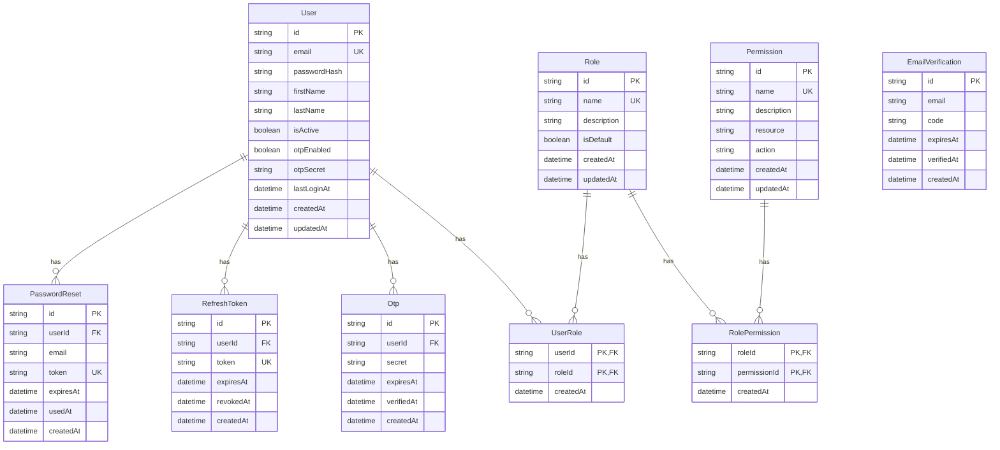

# NestJS Template Documentation

A comprehensive guide to the NestJS template with authentication, authorization, email verification, and more.

## Table of Contents

1. [Introduction](#introduction)
2. [Features](#features)
3. [Getting Started](#getting-started)
    - [Prerequisites](#prerequisites)
    - [Installation](#installation)
    - [Running the Application](#running-the-application)
4. [Architecture](#architecture)
    - [Directory Structure](#directory-structure)
    - [Clean Architecture](#clean-architecture)
    - [CQRS Pattern](#cqrs-pattern)
    - [Domain-Driven Design](#domain-driven-design)
    - [Value Objects](#value-objects)
    - [Repository Pattern](#repository-pattern)
    - [Mapper Pattern](#mapper-pattern)
5. [Authentication](#authentication)
    - [JWT Authentication](#jwt-authentication)
    - [API Endpoints](#authentication-endpoints)
    - [JWT Payload](#jwt-payload)
    - [Refresh Tokens](#refresh-tokens)
6. [Email Verification](#email-verification)
    - [Email Verification Flow](#email-verification-flow)
    - [API Endpoints](#email-verification-endpoints)
7. [Password Reset](#password-reset)
    - [Password Reset Flow](#password-reset-flow)
    - [API Endpoints](#password-reset-endpoints)
8. [Authorization System](#authorization-system)
    - [Role-based Access Control](#role-based-access-control)
    - [Permission-based Access Control](#permission-based-access-control)
    - [Resource Permissions](#resource-permissions)
    - [Usage Examples](#authorization-usage-examples)
9. [Database](#database)
    - [Migrations](#migrations)
    - [Seeds](#seeds)
    - [Default Credentials](#default-credentials)
10. [Tests](#tests)
11. [Email Service](#email-service)
12. [Docker Setup](#docker-setup)
13. [License](#license)

## Introduction

This NestJS template provides a robust foundation for building secure, well-structured backend applications with TypeScript. It includes comprehensive authentication and authorization features, email verification, password reset functionality, and more, all following clean architecture principles.

## Features

- 🔐 **Authentication**:
    - JWT-based authentication
    - Email verification
    - Password hashing with bcrypt
    - Refresh tokens
    - Logout functionality
    - Password reset

- 🛡️ **Authorization**:
    - Role-based access control (RBAC)
    - Permission-based access control
    - Resource-level permissions

- 📨 **Email**:
    - Email verification system
    - Password reset emails
    - Templated emails
    - Development and production-ready setup

- 🏗️ **Architecture**:
    - Clean Architecture principles
    - Command Query Responsibility Segregation (CQRS)
    - Domain-Driven Design concepts
        - Comprehensive Value Objects for stronger typing and encapsulation
        - Repository pattern with proper domain/persistence separation
        - Rich domain model with encapsulated behavior
    - Dependency Injection

- 🛠️ **Technologies**:
    - NestJS framework
    - TypeScript
    - PostgreSQL database
    - Prisma ORM
    - Redis for caching
    - Docker for local development
    - Nodemailer for emails

## Getting Started

### Prerequisites

- Node.js (v16 or higher)
- Docker and Docker Compose
- npm or yarn

### Installation

1. **Clone the repository**:
   ```bash
   git clone https://github.com/your-username/nestjs-template.git
   cd nestjs-template
   ```

2. **Install dependencies**:
   ```bash
   npm install
   ```

3. **Set up environment variables**:
   ```bash
   cp .env.example .env
   ```
   Edit the `.env` file to set secure values for secrets.

### Running the Application

1. **Start the services**:
   ```bash
   docker-compose up -d
   ```

2. **Run database migrations**:
   ```bash
   npx prisma migrate dev
   ```

3. **Generate Prisma client**:
   ```bash
   npx prisma generate
   ```

4. **Start the application**:
   ```bash
   npm run start:dev
   ```

The application will now be running at http://localhost:3000

## Architecture

The application follows clean architecture principles, separating concerns into distinct layers.

### Directory Structure

```
nestjs-template/
├── src/
│   ├── application/ - Application layer (Commands, DTOs)
│   ├── core/ - Domain layer (Entities, Value Objects, Services)
│   ├── infrastructure/ - Infrastructure layer (Repositories, Database)
│   ├── presentation/ - Presentation layer (Controllers, Guards)
│   └── shared/ - Shared utilities and decorators
├── prisma/ - Prisma schema and migrations
├── test/ - Tests
├── docker-compose.yml - Docker services configuration
├── Dockerfile - Application container configuration
└── .env.example - Example environment variables
```

### ERD
The following is the Entity-Relationship Diagram (ERD) for the application:


### Clean Architecture

The application follows a clean architecture approach with the following layers:

1. **Domain Layer** (`core/`): Contains the business entities, value objects, and core business logic.
   - **Entities**: Rich domain objects with behavior (User, Role, Permission, etc.)
   - **Value Objects**: Immutable objects representing domain concepts (Email, Name, VerificationCode, etc.)
   - **Services**: Domain services implementing core business logic
   - **Repository Interfaces**: Abstractions for data access

2. **Application Layer** (`application/`): Contains application-specific logic, command handlers, and DTOs.
   - **Commands/Queries**: CQRS implementation with handlers
   - **DTOs**: Data Transfer Objects for input/output
   - **Mappers**: Transform domain objects to/from DTOs

3. **Infrastructure Layer** (`infrastructure/`): Contains database repositories, external services, and other infrastructure concerns.
   - **Repositories**: Concrete implementations of repository interfaces
   - **Database**: Database connection and ORM configurations
   - **External Services**: Integration with external systems

4. **Presentation Layer** (`presentation/`): Contains controllers, guards, and other presentation concerns.
   - **Controllers**: HTTP endpoints with request/response handling
   - **Guards**: Authentication and authorization checks
   - **Filters**: Exception handling and logging

### CQRS Pattern

The application uses the Command Query Responsibility Segregation (CQRS) pattern, separating command operations (write) from query operations (read).

### Domain-Driven Design

The application follows Domain-Driven Design (DDD) principles, focusing on the core domain and domain logic. Domain concepts are represented as first-class citizens:

- **Entities**: Objects with identity and lifecycle (User, Role, Permission)
- **Value Objects**: Immutable objects representing concepts without identity (Email, Password)
- **Aggregates**: Clusters of entities and value objects treated as a unit
- **Repositories**: Collections of objects with data access methods
- **Domain Services**: Complex operations that don't fit in entities or value objects

### Value Objects

The application uses Value Objects to encapsulate domain concepts, providing:

1. **Type Safety**: Strong typing for domain values
2. **Validation**: Ensures values meet business rules
3. **Immutability**: Prevents unexpected changes
4. **Encapsulation**: Hides implementation details
5. **Domain Logic**: Business rules live with the data

#### Core Value Objects

| Value Object | Description | Validation Rules |
|--------------|-------------|------------------|
| `Email` | Email addresses with validation | Format validation with regex |
| `Password` | Passwords with strength requirements | Min length, requires mixed case, numbers, symbols |
| `FirstName`/`LastName` | Person name components | Length limits, formatting |
| `VerificationCode` | Codes for email verification | Format validation, generation |
| `Token` | Security tokens with validation | UUID validation, generation |
| `ResourceAction` | Permission components | Resource and action validation |
| `PermissionName` | Permission identifiers | Format validation (resource:action) |
| `UserId` | Type-safe user identifiers | UUID validation |

#### Usage Example

Instead of using primitive strings:

```typescript
// Without value objects - using primitives
function createUser(email: string, firstName: string): User {
  // Must validate email format here
  if (!isValidEmail(email)) throw new Error('Invalid email');
  
  // And here
  return new User(email, firstName);
}
```

Value objects handle validation internally:

```typescript
// With value objects
function createUser(email: Email, firstName: FirstName): User {
  // Email and FirstName are already validated
  return new User(email, firstName);
}

// Creating a user with value objects
const email = new Email('user@example.com'); // Throws if invalid
const firstName = new FirstName('John'); // Throws if invalid
const user = createUser(email, firstName);
```

### Repository Pattern

The application implements the Repository pattern to decouple the domain model from the data access logic:

1. **Repository Interfaces** (in `core/repositories/`): Define contracts for data access
2. **Repository Implementations** (in `infrastructure/repositories/`): Implement these contracts using specific technologies (Prisma)

#### Domain/Persistence Mapping

Repositories handle mapping between domain objects with value objects and database primitives:

```typescript
// Database stores primitives
// {
//   id: "123e4567-e89b-12d3-a456-426614174000",
//   email: "user@example.com", 
//   firstName: "John",
//   lastName: "Smith"
// }

// Mapping from database to domain in repository
private mapToModel(record: UserRecord): User {
  // Create value objects from primitives
  const email = new Email(record.email);
  const firstName = new FirstName(record.firstName);
  const lastName = new LastName(record.lastName);
  
  // Create entity with value objects
  const user = new User(email, firstName, lastName);
  user.id = record.id;
  
  return user;
}

// Mapping from domain to database in repository
async create(user: User): Promise<User> {
  const record = await this.database.create({
    id: user.id,
    email: user.email.getValue(), // Extract primitive from value object
    firstName: user.firstName.getValue(),
    lastName: user.lastName.getValue()
  });
  
  return this.mapToModel(record);
}
```

#### Error Handling

All repositories inherit from `BaseRepository` which provides consistent error handling:

```typescript
protected async executeWithErrorHandling<R>(
  operation: string,
  action: () => Promise<R>,
  fallbackValue?: R
): Promise<R> {
  try {
    return await action();
  } catch (error) {
    return this.handleError(operation, error, fallbackValue);
  }
}
```

### Mapper Pattern

The application uses the Mapper pattern to transform between domain entities and response/request DTOs:

#### Purpose

1. **Separation of Concerns**: Keep domain entities focused on business logic
2. **Consistent Transformation**: Standard way to convert between layers
3. **Value Object Handling**: Extract primitives from value objects for API responses

#### Implementation

Mappers are implemented in the application layer to convert between domain entities and DTOs:

```typescript
// User mapper example
export class UserMapper {
  // Maps a User entity to a UserDetailResponse DTO
  static toDetailResponse(user: User): UserDetailResponse {
    return {
      id: user.id,
      email: user.email.getValue(), // Extract primitive from value object
      firstName: user.firstName.getValue(),
      lastName: user.lastName.getValue(),
      isActive: user.isActive,
      otpEnabled: user.otpEnabled,
      lastLoginAt: user.lastLoginAt,
      roles: user.roles.map(role => ({
        id: role.id,
        name: role.name
      })),
      createdAt: user.createdAt,
      updatedAt: user.updatedAt
    };
  }
  
  // More mapping methods for different response types...
}
```

#### Usage

Commands and queries use these mappers to return consistent responses:

```typescript
@CommandHandler(LoginCommand)
export class LoginCommandHandler implements ICommandHandler<LoginCommand> {
  async execute(command: LoginCommand): Promise<AuthResponse> {
    const user = await this.authService.login(/*...*/);
    
    // Use mapper to convert domain entity to response DTO
    return {
      accessToken,
      refreshToken,
      user: UserMapper.toAuthResponse(user, true)
    };
  }
}
```

## Authentication

### JWT Authentication

The application uses JSON Web Tokens (JWT) for authentication. When a user logs in, they receive an access token and a refresh token. The access token is short-lived (15 minutes by default) and is used to authenticate API requests. The refresh token is long-lived (7 days by default) and can be used to obtain a new access token when the current one expires.

### Authentication Endpoints

#### Register User

- **URL**: `/auth/register`
- **Method**: `POST`
- **Auth**: None (Public)
- **Description**: Register a new user account
- **Request Body**:
  ```json
  {
    "email": "user@example.com",
    "password": "Password123!",
    "firstName": "John",
    "lastName": "Doe"
  }
  ```
- **Response**: Status `201 Created`
  ```json
  {
    "id": "550e8400-e29b-41d4-a716-446655440000",
    "email": "user@example.com",
    "firstName": "John",
    "lastName": "Doe"
  }
  ```

#### Login

- **URL**: `/auth/login`
- **Method**: `POST`
- **Auth**: None (Public)
- **Description**: Authenticate a user and get access tokens
- **Request Body**:
  ```json
  {
    "email": "user@example.com",
    "password": "Password123!"
  }
  ```
- **Response**: Status `200 OK` (Standard Login)
  ```json
  {
    "accessToken": "eyJhbGciOiJIUzI1NiIsInR5cCI6IkpXVCJ9...",
    "refreshToken": "a15e7a47-7a8f-4f1a-b3a7-c1524e7f324b",
    "user": {
      "id": "550e8400-e29b-41d4-a716-446655440000",
      "email": "user@example.com",
      "firstName": "John",
      "lastName": "Doe",
      "emailVerified": true,
      "roles": [
        {
          "id": "550e8400-e29b-41d4-a716-446655440001",
          "name": "user"
        }
      ]
    }
  }
  ```
- **Response**: Status `200 OK` (Email Verification Required)
  ```json
  {
    "requiresEmailVerification": true,
    "userId": "550e8400-e29b-41d4-a716-446655440000",
    "email": "user@example.com",
    "message": "Email verification required"
  }
  ```
- **Response**: Status `200 OK` (OTP-enabled User)
  ```json
  {
    "requiresOtp": true,
    "userId": "550e8400-e29b-41d4-a716-446655440000",
    "message": "OTP verification required"
  }
  ```

#### Refresh Token

- **URL**: `/auth/refresh-token`
- **Method**: `POST`
- **Auth**: None (Public)
- **Description**: Refresh an expired access token using a refresh token
- **Request Body**:
  ```json
  {
    "refreshToken": "a15e7a47-7a8f-4f1a-b3a7-c1524e7f324b"
  }
  ```
- **Response**: Status `200 OK`
  ```json
  {
    "accessToken": "eyJhbGciOiJIUzI1NiIsInR5cCI6IkpXVCJ9...",
    "refreshToken": "c35e7a47-7a8f-4f1a-b3a7-c1524e7f324d"
  }
  ```

#### Logout

- **URL**: `/auth/logout`
- **Method**: `POST`
- **Auth**: JWT (Bearer Token)
- **Description**: Log out the current user by revoking all their refresh tokens
- **Request Body**: None
- **Response**: Status `200 OK`
  ```json
  {
    "message": "Logged out successfully"
  }
  ```

#### Get Current User

- **URL**: `/auth/me`
- **Method**: `GET`
- **Auth**: JWT (Bearer Token)
- **Description**: Get information about the currently authenticated user
- **Response**: Status `200 OK`
  ```json
  {
    "id": "550e8400-e29b-41d4-a716-446655440000",
    "email": "user@example.com",
    "roles": ["user"]
  }
  ```

### JWT Payload

The JWT token payload contains:

```json
{
  "sub": "550e8400-e29b-41d4-a716-446655440000", // User ID
  "email": "user@example.com",
  "emailVerified": true,
  "roles": ["user"],
  "permissions": ["user:read"],
  "iat": 1680345600, // Issued at timestamp
  "exp": 1680349200  // Expiration timestamp
}
```

### Refresh Tokens

The application uses refresh tokens to obtain new access tokens without requiring the user to log in again. Refresh tokens are stored in the database and are revoked when:

- The user logs out
- The token is used to obtain a new access token
- The user's password is changed
- The user's account is disabled

## Email Verification

The application includes an email verification system that sends a verification code to the user's email address.

### Email Verification Flow

1. User registers or requests email verification
2. Server generates a verification code and sends it to the user's email
3. User enters the verification code
4. Server verifies the code and marks the email as verified
5. User can now access protected resources

### Email Verification Endpoints

#### Send Verification Email

- **URL**: `/auth/email/send-verification`
- **Method**: `POST`
- **Auth**: None (Public)
- **Description**: Send a verification code to the specified email address
- **Request Body**:
  ```json
  {
    "email": "user@example.com"
  }
  ```
- **Response**: Status `200 OK`
  ```json
  {
    "message": "Verification email sent successfully"
  }
  ```

#### Verify Email

- **URL**: `/auth/email/verify`
- **Method**: `POST`
- **Auth**: None (Public)
- **Description**: Verify an email with a verification code. If successful, returns auth tokens like the login endpoint.
- **Request Body**:
  ```json
  {
    "email": "user@example.com",
    "code": "123456"
  }
  ```
- **Response**: Status `200 OK` (Success)
  ```json
  {
    "accessToken": "eyJhbGciOiJIUzI1NiIsInR5cCI6IkpXVCJ9...",
    "refreshToken": "a15e7a47-7a8f-4f1a-b3a7-c1524e7f324b",
    "user": {
      "id": "550e8400-e29b-41d4-a716-446655440000",
      "email": "user@example.com",
      "firstName": "John",
      "lastName": "Doe",
      "emailVerified": true,
      "roles": [
        {
          "id": "550e8400-e29b-41d4-a716-446655440001",
          "name": "user"
        }
      ]
    }
  }
  ```
- **Response**: Status `200 OK` (Failure)
  ```json
  {
    "verified": false
  }
  ```

#### Check Email Verification Status

- **URL**: `/auth/email/status/:email`
- **Method**: `GET`
- **Auth**: None (Public)
- **Description**: Check if an email address is verified
- **Response**: Status `200 OK`
  ```json
  {
    "verified": true
  }
  ```

## Password Reset

The application includes a password reset flow that allows users to reset their password if they've forgotten it.

### Password Reset Flow

1. User requests a password reset
2. Server generates a reset token and sends an email with a reset link
3. User clicks the link and enters a new password
4. Server verifies the token and updates the password
5. User can now log in with the new password

### Password Reset Endpoints

#### Request Password Reset

- **URL**: `/auth/password/request-reset`
- **Method**: `POST`
- **Auth**: None (Public)
- **Description**: Request a password reset email
- **Request Body**:
  ```json
  {
    "email": "user@example.com"
  }
  ```
- **Response**: Status `200 OK`
  ```json
  {
    "message": "Password reset email sent successfully"
  }
  ```

#### Reset Password

- **URL**: `/auth/password/reset`
- **Method**: `POST`
- **Auth**: None (Public)
- **Description**: Reset a password using a reset token
- **Request Body**:
  ```json
  {
    "token": "a15e7a47-7a8f-4f1a-b3a7-c1524e7f324b",
    "newPassword": "NewPassword123!"
  }
  ```
- **Response**: Status `200 OK`
  ```json
  {
    "success": true,
    "message": "Password reset successfully"
  }
  ```

## Authorization System

The authorization system provides two levels of access control: role-based and permission-based.

### Role-based Access Control

Role-based access control (RBAC) assigns roles to users and controls access based on these roles. The application includes two default roles:

- `admin`: Administrator role with full access
- `user`: Regular user role with limited access

### Permission-based Access Control

Permission-based access control provides fine-grained control over what users can do. Permissions are associated with roles, and users inherit permissions from their roles.

Default permissions include:

- `user:read`: Can read user information
- `user:write`: Can create and update user information
- `user:delete`: Can delete users
- `role:read`: Can read role information
- `role:write`: Can create and update roles
- `role:delete`: Can delete roles

### Resource Permissions

The application includes resource permission helpers for common operations:

- `@CanRead(resource)`: Requires '{resource}:read' permission
- `@CanWrite(resource)`: Requires '{resource}:write' permission
- `@CanDelete(resource)`: Requires '{resource}:delete' permission
- `@ResourcePermissions(resource, actions)`: Requires multiple permissions for a resource
- `@FullResourceAccess(resource)`: Requires read, write, and delete permissions for a resource

### Authorization Usage Examples

#### Protecting a Controller with Role-based Access

```typescript
@Controller('admin')
@UseGuards(RolesGuard)
@Roles(RolesEnum.ADMIN)
export class AdminController {
  // Only admins can access these endpoints
}
```

#### Protecting a Controller with Permission-based Access

```typescript
@Controller('roles')
@UseGuards(PermissionsGuard)
@RequirePermissions('role:read')
export class RoleController {
  // All methods require 'role:read' permission
  
  @Post()
  @CanWrite('role')  // Additionally requires 'role:write' permission
  createRole() {
    // Implementation
  }
  
  @Delete(':id')
  @CanDelete('role')  // Additionally requires 'role:delete' permission
  deleteRole() {
    // Implementation
  }
}
```

## Database

The application uses PostgreSQL as the database and Prisma as the ORM.

### Migrations

Migrations are managed using Prisma Migrate. The initial migration creates all the required tables for the application.

#### Running Migrations

To run migrations and update your database schema:

```bash
# Apply migrations to the database
npm run db:migrate

# Or to just push the schema without migrations
npm run db:push
```

### Seeds

Seeds provide initial data for the database, including:

1. Default roles (`admin` and `user`)
2. Default permissions (read, write, delete for user and role resources)
3. Admin user with credentials:
    - Email: admin@example.com
    - Password: Admin@123

#### Running Seeds

To seed your database with initial data:

```bash
# Seed the database
npm run db:seed
```

### Default Credentials

After running the seed script, you can login with:
- **Email**: admin@example.com
- **Password**: Admin@123

**Note**: In a production environment, you should change these default credentials immediately after deployment.

## Email Service

The application includes an email service built with Nodemailer. The email service supports:

- Verification emails
- Password reset emails
- Welcome emails

In development mode, the template uses MailHog to catch and display emails. After starting the services with Docker Compose, you can access the MailHog web interface at http://localhost:8025 to view sent emails.

## Tests

The test implementation follows best practices including:
- Clear Arrange/Act/Assert structure
- Mocking of dependencies
- Testing both happy and error paths
- Clear test naming and organization

You can run the tests using the npm scripts defined in package.json:
- `npm test` - Run unit tests
- `npm run test:cov` - Run with coverage
- `npm run test:e2e` - Run end-to-end tests

## Docker Setup

The application includes a `docker-compose.yml` file that sets up:

- PostgreSQL database
- Redis cache
- MailHog for email testing

To start the Docker services:

```bash
docker-compose up -d
```

You can also run the application in Docker by uncommenting the API service in the `docker-compose.yml` file.

## License

This project is licensed under the MIT License.
