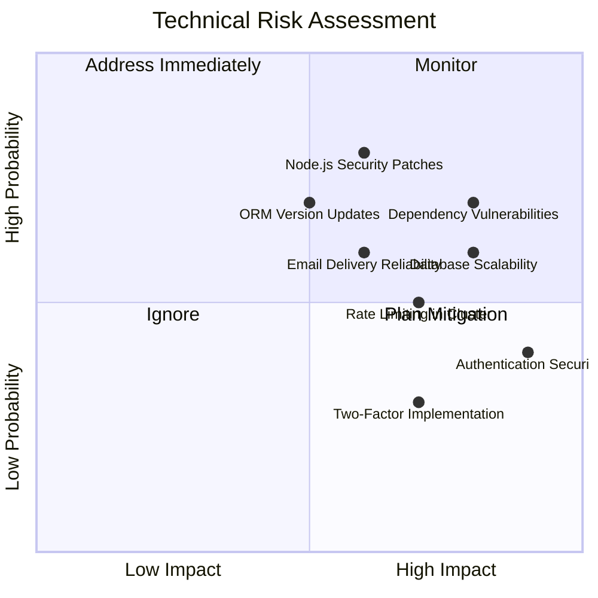
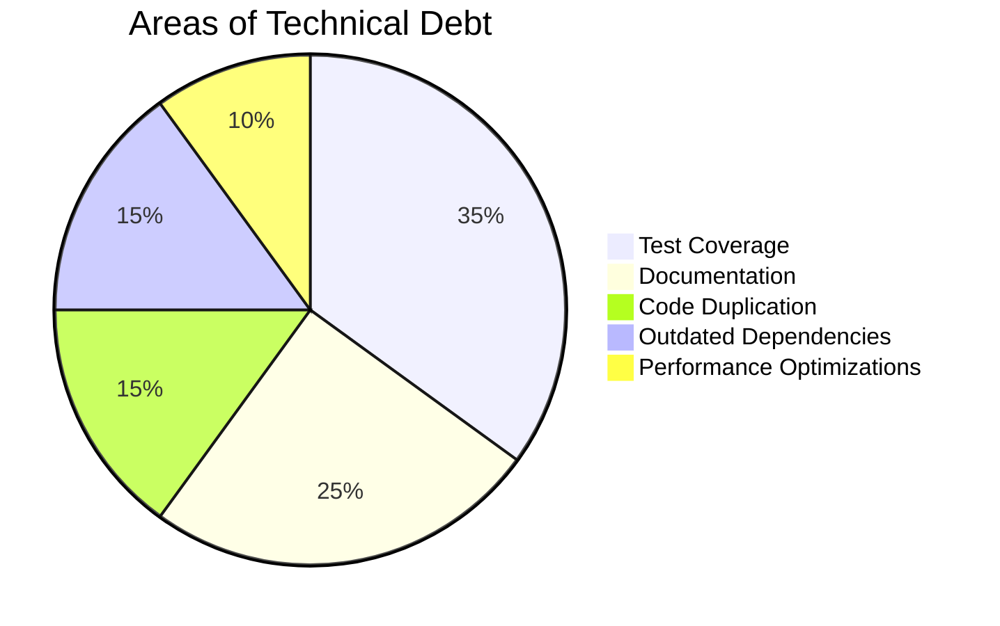

# Risks and Technical Debt

## Technical Risks

### Risk Analysis Matrix

### High Priority Risks

#### 1. Dependency Vulnerabilities

| Aspect | Description |
|--------|-------------|
| Risk | Third-party dependencies may contain security vulnerabilities that could compromise the application |
| Impact | High - Could lead to security breaches, data leaks, or system compromise |
| Probability | High - NPM ecosystem has frequent security updates and vulnerabilities |
| Mitigation | Regular dependency audits, automated vulnerability scanning in CI/CD, security update automation |

#### 2. Node.js Security Patches

| Aspect | Description |
|--------|-------------|
| Risk | Delayed application of Node.js security patches could leave the system vulnerable |
| Impact | Medium - Depends on the specific vulnerabilities addressed |
| Probability | High - Regular security updates are released for Node.js |
| Mitigation | Keep Node.js version updated, automate security patch application, use Docker images with latest security fixes |

#### 3. Database Scalability

| Aspect | Description |
|--------|-------------|
| Risk | Database performance may degrade under high load, especially with complex permission checks |
| Impact | High - Could affect system availability and user experience |
| Probability | Medium - Depends on growth and query optimization |
| Mitigation | Implement database indexing strategy, query optimization, connection pooling, consider read replicas for scaling |

### Medium Priority Risks

#### 1. Rate Limiting in Cluster

| Aspect | Description |
|--------|-------------|
| Risk | Rate limiting may not work effectively in a clustered environment without shared state |
| Impact | Medium - Could allow more requests than intended, but not a direct security issue |
| Probability | Medium - Occurs when scaling horizontally without shared state |
| Mitigation | Implement Redis-based distributed rate limiting, consider API gateway rate limiting |

#### 2. Email Delivery Reliability

| Aspect | Description |
|--------|-------------|
| Risk | Email delivery failures could prevent users from completing email verification or password resets |
| Impact | Medium - Affects specific user flows but not overall system integrity |
| Probability | Medium - Email delivery issues are common |
| Mitigation | Use reliable email service provider, implement retry mechanisms, provide alternative verification methods |

#### 3. Authentication Security

| Aspect | Description |
|--------|-------------|
| Risk | JWT implementation may have vulnerabilities or could be strengthened |
| Impact | High - Authentication is a critical security component |
| Probability | Low - Current implementation follows best practices |
| Mitigation | Regular security reviews, stay updated on JWT security best practices, consider additional security measures like token binding |

## Technical Debt

### Current Technical Debt

#### 1. Test Coverage Gaps

| Aspect | Description |
|--------|-------------|
| Debt | Some areas lack comprehensive test coverage, particularly integration tests |
| Impact | Increases risk of introducing bugs when making changes |
| Remediation | Implement test coverage targets, prioritize critical paths for testing, integrate coverage reporting in CI/CD |

#### 2. Documentation Incompleteness

| Aspect | Description |
|--------|-------------|
| Debt | Some areas of the codebase and API lack detailed documentation |
| Impact | Slows down onboarding of new developers, increases support burden |
| Remediation | Establish documentation standards, implement automated API documentation, prioritize critical component documentation |

#### 3. Code Duplication

| Aspect | Description |
|--------|-------------|
| Debt | Some similar logic is duplicated across commands and services |
| Impact | Makes maintenance more difficult, increases risk of inconsistent behavior |
| Remediation | Refactor common logic into shared utilities, regular code quality reviews, DRY principle enforcement |

#### 4. Outdated Dependencies

| Aspect | Description |
|--------|-------------|
| Debt | Some dependencies may be several minor versions behind current releases |
| Impact | Miss performance improvements, bug fixes, and minor features |
| Remediation | Regular dependency update schedule, automated dependency updates for minor versions |

## Improvement Opportunities

### Short-term Improvements

| Improvement | Description | Effort | Impact |
|-------------|-------------|--------|--------|
| Test Coverage | Increase unit and integration test coverage | Medium | High |
| API Documentation | Complete OpenAPI/Swagger documentation | Low | Medium |
| Dependency Updates | Update all dependencies to latest minor versions | Low | Medium |
| Error Handling Review | Review and standardize error handling across codebase | Medium | Medium |

### Medium-term Improvements

| Improvement | Description | Effort | Impact |
|-------------|-------------|--------|--------|
| Distributed Rate Limiting | Implement Redis-based rate limiting | Medium | Medium |
| Query Optimization | Review and optimize database queries | Medium | High |
| Monitoring Improvements | Enhance logging and monitoring capabilities | Medium | Medium |
| Code Duplication Reduction | Refactor common patterns into shared utilities | High | Medium |

### Long-term Improvements

| Improvement | Description | Effort | Impact |
|-------------|-------------|--------|--------|
| Event Sourcing | Consider event sourcing for audit and history | High | High |
| GraphQL Support | Add GraphQL API alongside REST | High | Medium |
| Microservices Preparation | Prepare for potential microservice transition | High | Medium |
| Advanced Caching | Implement more sophisticated caching strategies | Medium | High |

## Technical Debt Management Strategy

1. **Regular Debt Review**: Quarterly review of technical debt items and prioritization
2. **Debt Reduction Sprints**: Allocate 20% of development time to addressing technical debt
3. **Preventive Measures**: Code review standards, automated quality checks, architectural reviews
4. **Documentation**: Maintain a living document of known technical debt with severity and remediation plans
5. **Monitoring**: Track technical debt metrics over time to ensure improvement

By proactively managing risks and technical debt, the project can maintain a healthy codebase that remains adaptable to future requirements while minimizing the accumulation of problems that could impact development velocity or system quality.
