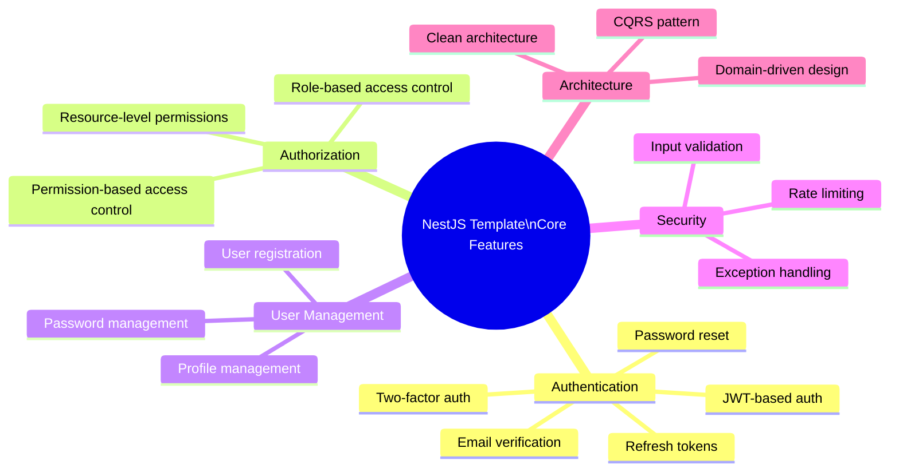

# Introduction and Goals

## Executive Summary

This NestJS template provides a robust foundation for building secure, scalable, and maintainable backend applications. It implements a clean architecture pattern with comprehensive authentication, authorization, and user management capabilities. The system is designed to meet enterprise-grade requirements while maintaining developer productivity.

## Requirements Overview

### Primary Features

## Quality Goals

| Priority | Quality Goal | Motivation |
|----------|--------------|------------|
| 1 | Security | The system handles sensitive user data and authentication, requiring robust security measures |
| 2 | Scalability | The architecture should support growth in users and features without redesign |
| 3 | Maintainability | The codebase should be easy to maintain and extend by development teams |
| 4 | Testability | All components should be easily testable to ensure stability |
| 5 | Performance | API responses should be optimized for low latency |

## Stakeholders

| Role | Expectations |
|------|-------------|
| Backend Developers | Clean, well-documented code that follows best practices |
| Frontend Developers | Reliable, well-documented API endpoints |
| DevOps Engineers | Easily deployable application with monitoring capabilities |
| Security Teams | Secure handling of authentication and sensitive data |
| Project Managers | Stable foundation that reduces development time for new features |
