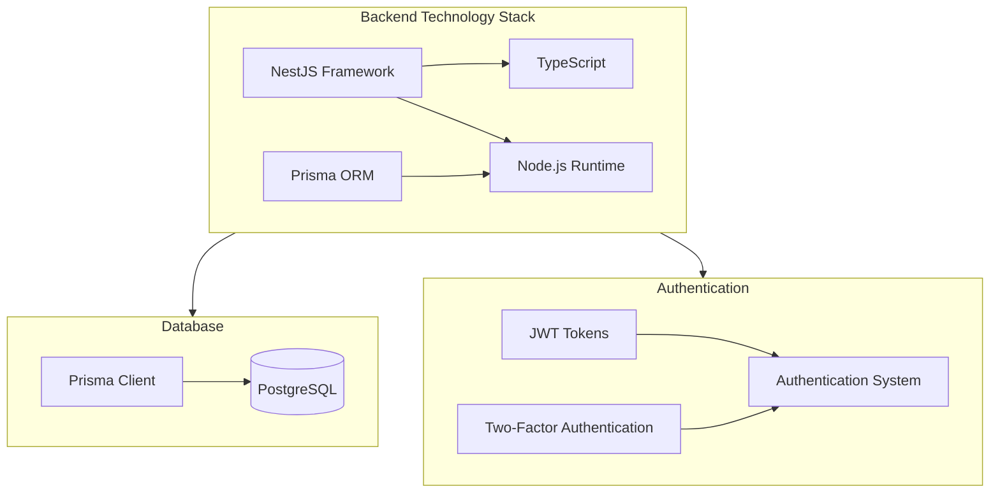

# Constraints

## Technical Constraints

### Technology Stack

| Component | Constraint | Rationale |
|-----------|------------|------------|
| Language | TypeScript | Type safety, better developer experience |
| Framework | NestJS | Structured architecture, built-in features, DI support |
| ORM | Prisma | Type-safe database access, schema migrations |
| Database | PostgreSQL | Relational data model fits the domain, robust and mature |
| Authentication | JWT | Stateless authentication for scalability |
| Container | Docker | Consistent deployment across environments |

## Organizational Constraints

| Constraint | Description | Background |
|------------|-------------|------------|
| Development Process | Agile methodology with CI/CD | Ensures quality and frequent delivery |
| Code Quality | Must pass linting, tests, and review | Maintains high code quality standards |
| Documentation | Architecture, API, and code must be documented | Helps onboarding and maintenance |

## Conventions

| Area | Convention | Description |
|------|------------|-------------|
| Code Style | ESLint configuration | Ensures consistent code formatting and style |
| Architecture | Clean Architecture / DDD | Separation of concerns, domain focus |
| API Design | RESTful principles | Consistent API patterns |
| Testing | Unit, integration, e2e tests | Comprehensive test coverage |
| Git | Feature branches, PR workflow | Controlled integration of changes |
