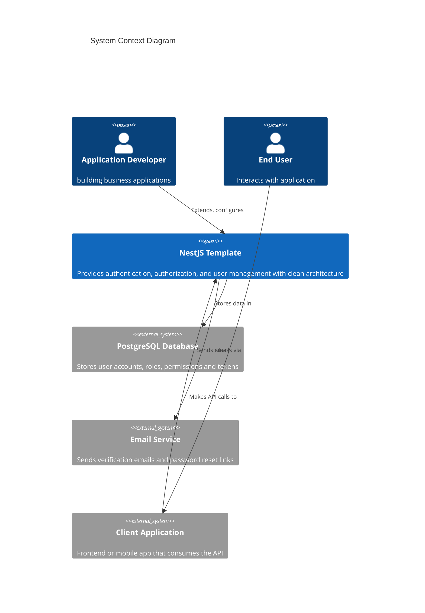
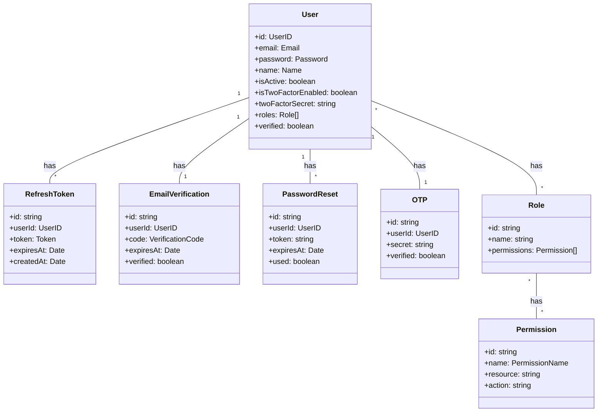

# Context and Scope

## System Context

The NestJS template serves as a foundation for building secure and scalable backend applications. It provides a complete authentication and authorization system, user management, and a clean architecture that can be extended for specific business requirements.

## External Interfaces

| Interface | Description | Protocol | Data Format |
|-----------|-------------|----------|-------------|
| REST API | Primary interface for client applications | HTTP/HTTPS | JSON |
| Database | Data persistence | TCP/IP | SQL (via Prisma) |
| Email Service | For sending verification emails | SMTP | Text/HTML |

## Domain Model

The core domain model represents the primary entities in the authentication and authorization system:

This domain model represents the core entities in the system and their relationships, providing a foundation for the authentication and authorization features.
