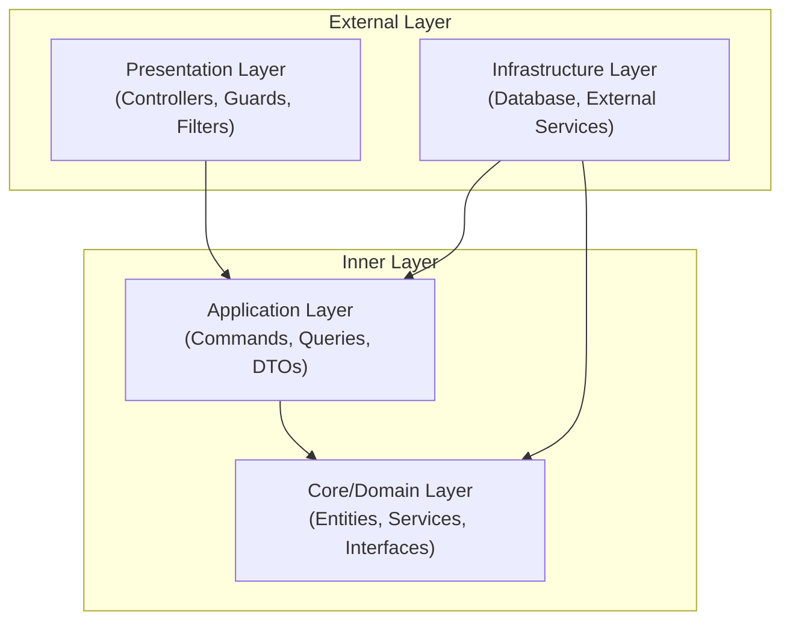

# Solution Strategy

## Key Architecture Decisions

The solution is built on several key architectural principles and patterns:

### Clean Architecture

The system follows a clean architecture approach, separating the application into layers with distinct responsibilities:

### Domain-Driven Design (DDD)

The core domain layer uses DDD principles:

- **Entities**: Domain objects with identity (User, Role)
- **Value Objects**: Immutable objects without identity (Email, Password)
- **Repositories**: Interfaces for data access
- **Domain Services**: Business logic (AuthService, UserService)

### Command Query Responsibility Segregation (CQRS)

The application layer implements a CQRS pattern:

- **Commands**: For operations that change state (RegisterUser, CreateRole)
- **Queries**: For operations that read state (GetUser, GetRoles)
- **DTOs**: Data transfer objects for input/output

## Technology Choices

| Technology | Purpose | Benefits |
|------------|---------|----------|
| NestJS | Backend framework | Modular architecture, dependency injection, built-in features |
| TypeScript | Programming language | Type safety, better tooling, developer experience |
| Prisma | ORM | Type-safe database access, migrations, schema management |
| PostgreSQL | Database | ACID compliance, relational model, performance |
| JWT | Authentication | Stateless, scalable authentication |
| Docker | Containerization | Consistent environments, easy deployment |

## Quality Approaches

| Quality Attribute | Approach | Implementation |
|-------------------|----------|---------------|
| Security | Defense in depth | JWT, password hashing, rate limiting, input validation |
| Maintainability | Clean code | Modular design, SOLID principles, clear separation of concerns |
| Testability | Test-driven approach | Unit tests, integration tests, E2E tests |
| Performance | Efficient data access | ORM optimization, selective loading, caching |
| Scalability | Stateless design | Horizontal scaling support, containerization |
