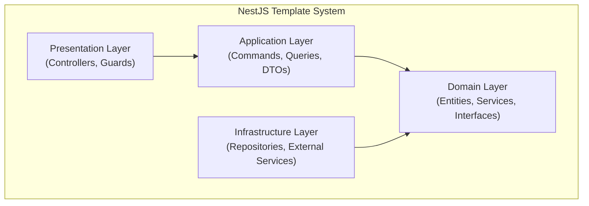
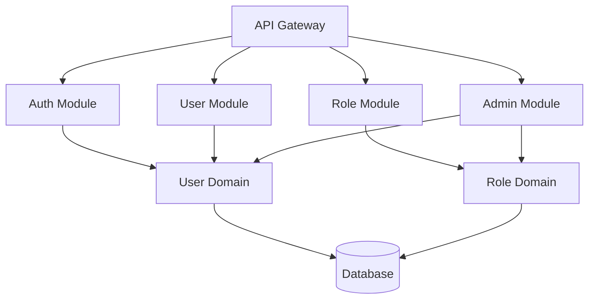
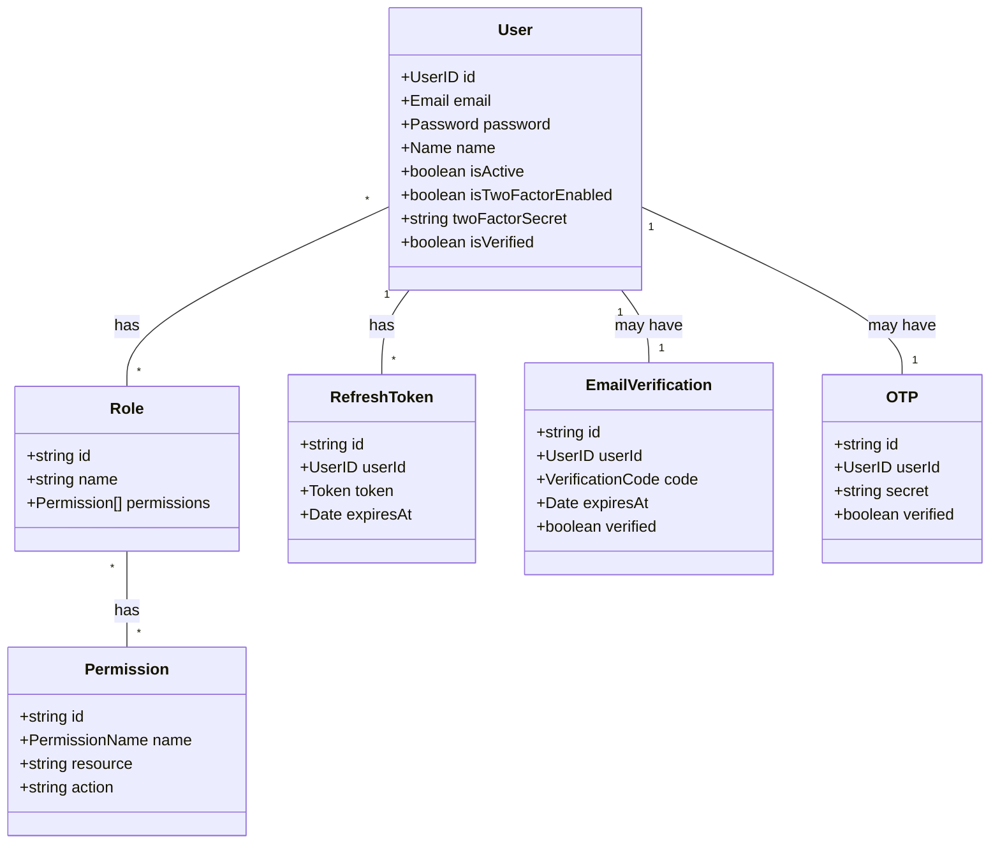
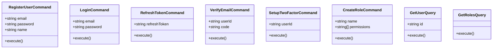
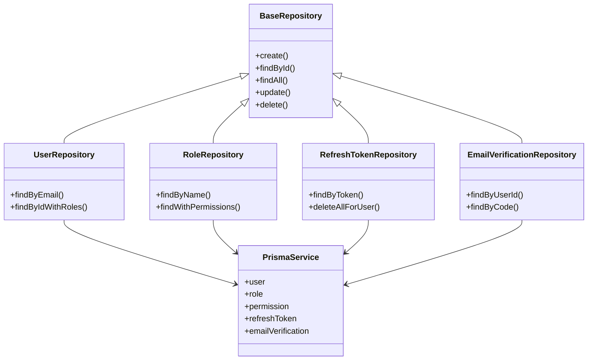

# Building Block View

## System Overview

The system architecture follows a clean architecture pattern with distinct layers:



## Level 1: Overall System

At the highest level, the system is composed of several main modules:



## Level 2: Core Modules

### Auth Module

```mermaid
componentDiagram
    component "Auth Controller" as AuthController
    component "Auth Service" as AuthService
    component "Token Provider" as TokenProvider
    component "JWT Strategy" as JWTStrategy
    component "Email Provider" as EmailProvider
    component "OTP Provider" as OTPProvider
    
    AuthController ..> AuthService : uses
    AuthService ..> TokenProvider : uses
    AuthService ..> EmailProvider : uses
    AuthService ..> OTPProvider : uses
    JWTStrategy ..> TokenProvider : uses
```

### User Module

```mermaid
componentDiagram
    component "User Controller" as UserController
    component "User Service" as UserService
    component "User Repository" as UserRepository
    
    UserController ..> UserService : uses
    UserService ..> UserRepository : uses
```

### Role Module

```mermaid
componentDiagram
    component "Role Controller" as RoleController
    component "Role Service" as RoleService
    component "Permission Service" as PermissionService
    component "Role Repository" as RoleRepository
    component "Permission Repository" as PermissionRepository
    
    RoleController ..> RoleService : uses
    RoleService ..> RoleRepository : uses
    RoleService ..> PermissionService : uses
    PermissionService ..> PermissionRepository : uses
```

## Level 3: Core Components

### Domain Layer Core Components



### Application Layer Core Components



### Infrastructure Layer Core Components



These building blocks compose the clean architecture pattern implemented in the NestJS template, providing a modular and maintainable structure for the application.
