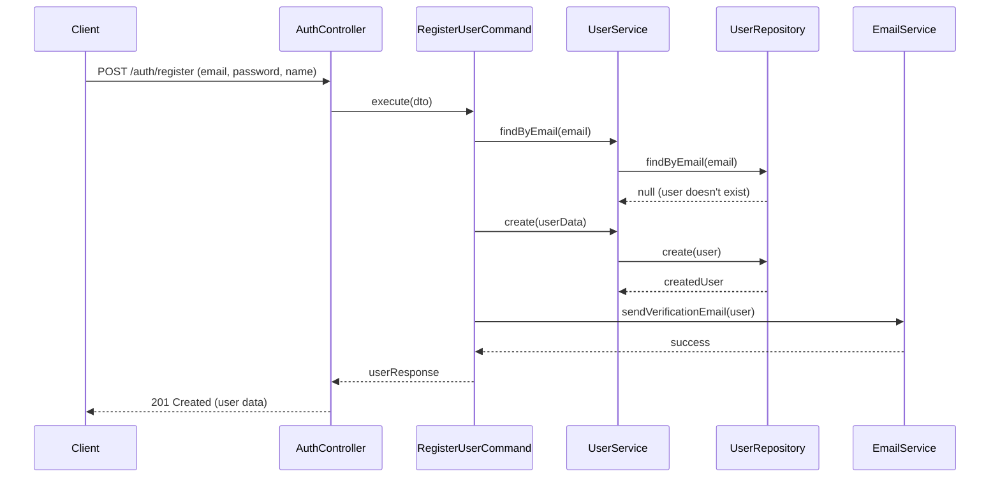
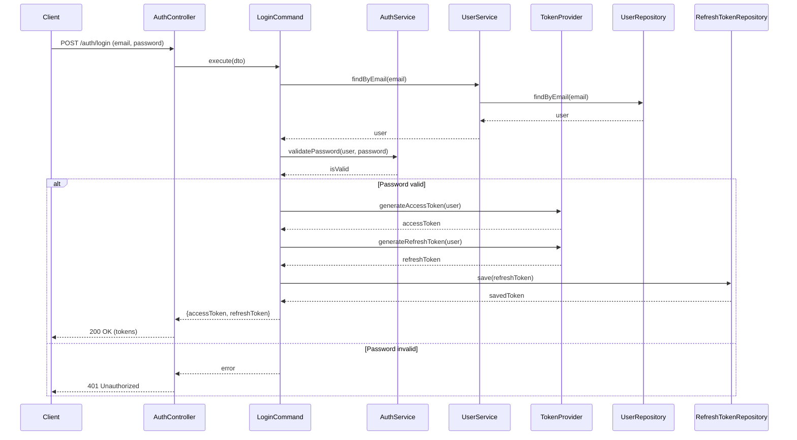
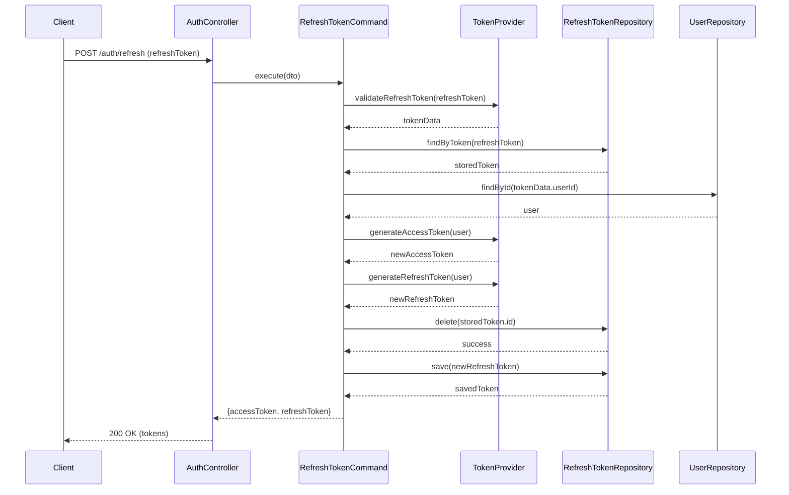
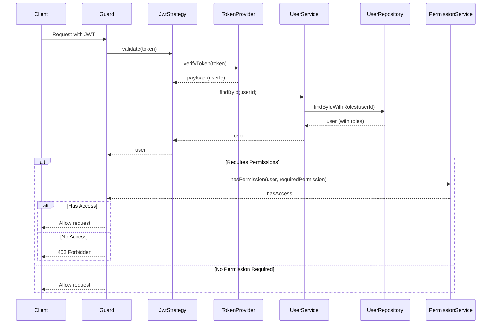
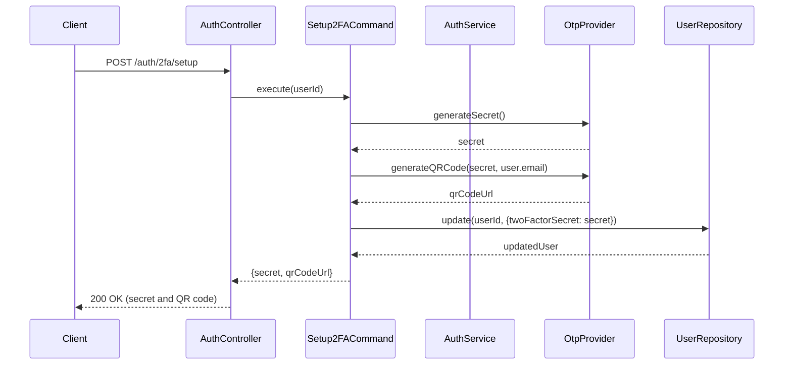
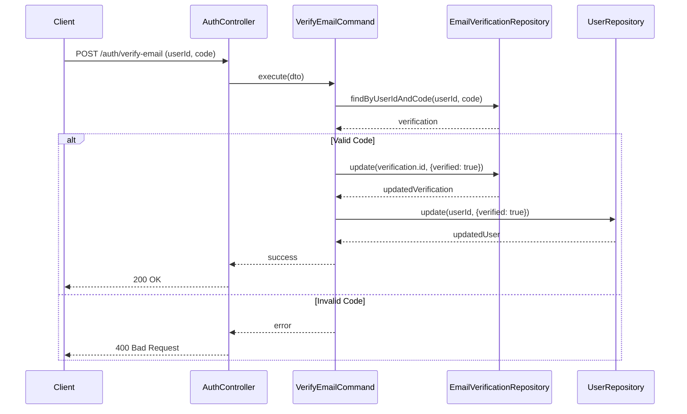

# Runtime View

## Key Scenarios

This section illustrates the runtime behavior of the system in key scenarios.

### User Registration Flow

### Authentication Flow

### Token Refresh Flow

### Authorization Check Flow

### Two-Factor Authentication Setup

### Email Verification Flow

These runtime views illustrate the key flows in the system, showing how the different components interact to implement the application's features.
