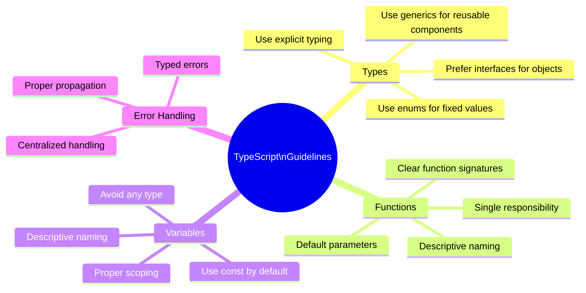

# Coding Standards

## Introduction

This document outlines the coding standards and guidelines for the project. Following these standards ensures code consistency, maintainability, and readability across the codebase.

## TypeScript and NestJS Guidelines

### General TypeScript Guidelines



### NestJS Specific Guidelines

- Follow the NestJS module organization pattern
- Use dependency injection for all dependencies
- Use NestJS decorators consistently
- Keep controllers thin, delegate business logic to services
- Use DTOs for data validation and transfer
- Use pipes for input validation
- Use proper exception filters for error handling

## Clean Architecture Implementation

### Layer Responsibilities

| Layer | Responsibility | Examples |
|-------|----------------|----------|
| Domain | Business entities and logic | Entities, Value Objects, Domain Services |
| Application | Use cases, workflow | Commands, Queries, DTOs |
| Infrastructure | Technical implementations | Repositories, External Services |
| Presentation | User interface | Controllers, Guards, Filters |

### File Organization

```
src/
├── application/
│   ├── commands/
│   ├── queries/
│   └── dtos/
├── core/
│   ├── entities/
│   ├── value-objects/
│   ├── repositories/
│   └── services/
├── infrastructure/
│   ├── config/
│   ├── database/
│   ├── repositories/
│   └── services/
└── presentation/
    ├── controllers/
    ├── filters/
    ├── guards/
    └── modules/
```

## CQRS Implementation Guidelines

### Commands

- Commands should be named with verb-noun pattern (e.g., `CreateUserCommand`)
- Commands should have a single public `execute()` method
- Commands should perform a single operation
- Commands should not return domain entities directly

### Queries

- Queries should be named with get-noun pattern (e.g., `GetUserQuery`)
- Queries should have a single public `execute()` method
- Queries should be optimized for read operations
- Queries should return DTOs rather than domain entities

## Testing Standards

### Unit Tests

- Test each unit in isolation
- Mock all dependencies
- Focus on testing business logic and edge cases
- Follow the AAA pattern (Arrange, Act, Assert)

### Integration Tests

- Test component interactions
- Test database interactions through repositories
- Test external service integrations

### E2E Tests

- Test complete API flows
- Test from the API consumer perspective
- Cover critical user journeys

## Code Quality Tools

### ESLint Configuration

The project uses ESLint with a custom configuration to enforce coding standards. The configuration includes:

- TypeScript-specific rules
- NestJS-specific rules
- Import order rules
- Formatting rules

### Prettier Configuration

Prettier is used for code formatting with the following key settings:

- Single quotes
- No semi-colons
- 2 space indentation
- 100 character line length

## Pull Request Guidelines

- Keep PRs focused on a single concern
- Include appropriate tests
- Ensure all existing tests pass
- Ensure code meets all linting standards
- Include documentation updates where relevant
- Reference related issues or requirements

## Documentation Standards

- Use JSDoc comments for public APIs and interfaces
- Document complex algorithms and business rules
- Update relevant documentation when changing functionality
- Use clear, concise language

By following these standards, we ensure that our codebase remains maintainable, understandable, and of high quality as the project evolves.
