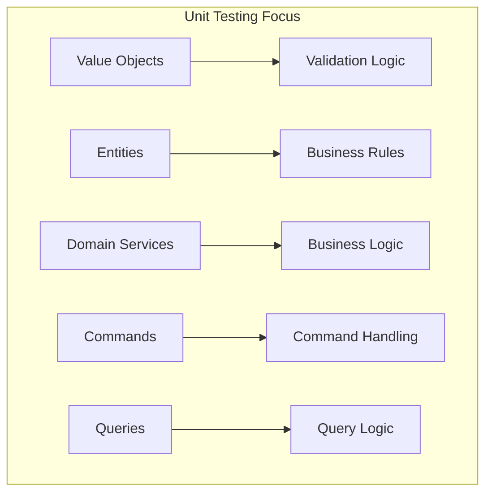
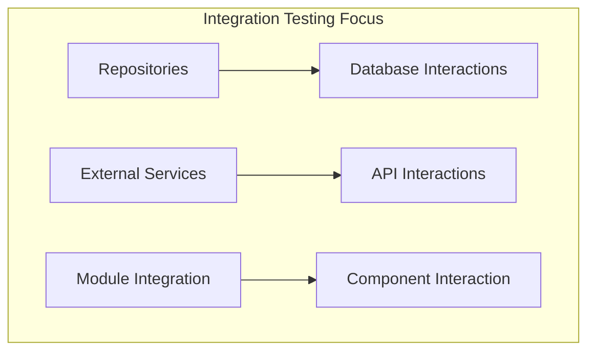
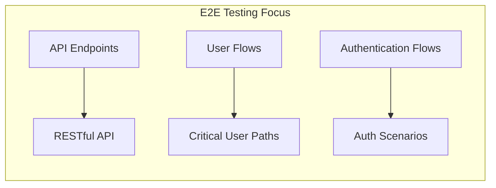
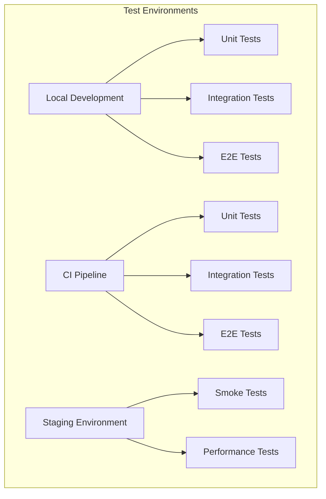

# Testing Strategy

## Introduction

This document outlines the comprehensive testing strategy for the project. A robust testing approach ensures reliability, maintainability, and confidence in the codebase.

## Testing Pyramid

We follow the testing pyramid approach with a balanced distribution of test types:

```mermaid
pyramid-schema
    title Testing Pyramid
    E2E Tests: 10
    Integration Tests: 30
    Unit Tests: 60
```

## Test Types and Responsibility

### Unit Tests



**Characteristics:**
- Tests individual units in isolation
- Dependencies are mocked
- Fast execution
- High coverage

**Frameworks and Tools:**
- Jest for test runner and assertions
- TypeMoq for mocking

**Coverage Target:**
- Minimum 80% code coverage
- 100% coverage for critical business logic

### Integration Tests



**Characteristics:**
- Tests interaction between components
- Limited mocking (primarily external dependencies)
- Tests database interactions
- Tests external service integrations

**Frameworks and Tools:**
- Jest for test runner
- Test databases for database interactions
- Mock servers for external APIs

**Coverage Target:**
- Key integration points covered
- All repositories and external service adapters tested

### End-to-End Tests



**Characteristics:**
- Tests complete user flows
- Tests from the API consumer perspective
- Limited in number, focused on critical paths
- Slower execution

**Frameworks and Tools:**
- Jest and Supertest for API testing
- Test database with initial seed data
- CI/CD pipeline integration

**Coverage Target:**
- All critical business flows covered
- Authentication and authorization scenarios covered
- Key error paths tested

## Test Environment Strategy



### Local Development

- Developers run tests locally before pushing code
- Docker Compose for local database and dependencies
- In-memory database option for faster tests

### CI Pipeline

- All tests run on each pull request
- Test databases provisioned for each test run
- Test results reported and linked to pull requests
- Coverage reports generated and tracked

### Staging Environment

- Smoke tests run after deployment
- Performance tests run on scheduled basis
- Security scans integrated with the testing process

## Test Data Management

### Strategies

1. **Fixtures:** Pre-defined test data for specific scenarios
2. **Factories:** Dynamic test data generation based on templates
3. **Seeding:** Database initialization with known state
4. **Clean-up:** Ensuring tests don't affect each other

### Best Practices

- Tests should be independent and idempotent
- Use unique identifiers to prevent test data collisions
- Clean up resources after tests complete
- Use transactions for database tests where appropriate

## Mocking Strategy

### What to Mock

- External services and APIs
- Database access in unit tests
- Time-dependent functionality
- Non-deterministic behavior

### What Not to Mock

- The system under test
- Simple value objects
- Actual database interactions in integration tests

## Testing Patterns

### Arrange-Act-Assert (AAA)

```typescript
// Arrange: Set up the test data and conditions
const userData = { email: 'test@example.com', password: 'Password123!' };
const userRepositoryMock = mock<UserRepository>();
const service = new UserService(userRepositoryMock.object);

// Act: Perform the action being tested
const result = await service.createUser(userData);

// Assert: Verify the results
expect(result).toBeDefined();
expect(result.email).toEqual(userData.email);
```

### Given-When-Then (BDD Style)

```typescript
describe('User registration', () => {
  it('should register a new user when valid data is provided', async () => {
    // Given
    const userData = { email: 'test@example.com', password: 'Password123!' };
    const userRepositoryMock = mock<UserRepository>();
    const service = new UserService(userRepositoryMock.object);
    
    // When
    const result = await service.createUser(userData);
    
    // Then
    expect(result).toBeDefined();
    expect(result.email).toEqual(userData.email);
  });
});
```

## Code Coverage

### Coverage Metrics

- **Statement coverage:** Percentage of code statements executed
- **Branch coverage:** Percentage of branches executed
- **Function coverage:** Percentage of functions called

### Coverage Tools

- Jest's built-in coverage reporting
- SonarQube integration for trend analysis
- Coverage reports in CI/CD pipeline

### Coverage Targets

| Component | Coverage Target |
|-----------|----------------|
| Domain Layer | 90%+ |
| Application Layer | 85%+ |
| Infrastructure Layer | 75%+ |
| Presentation Layer | 75%+ |
| Overall | 80%+ |

## Test Automation and CI/CD Integration

### Pull Request Flow

1. Developer creates a pull request
2. CI/CD pipeline runs all tests
3. Coverage reports generated
4. Test results reported on pull request
5. PR cannot be merged if tests fail or coverage drops

### Continuous Integration

- Tests run on each commit
- Parallel test execution for faster feedback
- Test flakiness monitoring and management

### Reporting

- Test results visualization
- Trending of test metrics over time
- Failure analysis and categorization

## Specialized Testing

### Performance Testing

- Load testing for API endpoints
- Stress testing for failure scenarios
- Endurance testing for memory leaks

### Security Testing

- OWASP vulnerability scanning
- Authentication and authorization testing
- Input validation and sanitization testing

## Maintenance and Evolution

### Test Refactoring

- Regular review of test code quality
- Refactor tests alongside application code
- Extract common test utilities and helpers

### Test Documentation

- Document test strategy and approach
- Document complex test scenarios
- Keep test documentation updated

By following this testing strategy, we ensure robust, reliable, and maintainable code that meets quality standards and can evolve with confidence.
