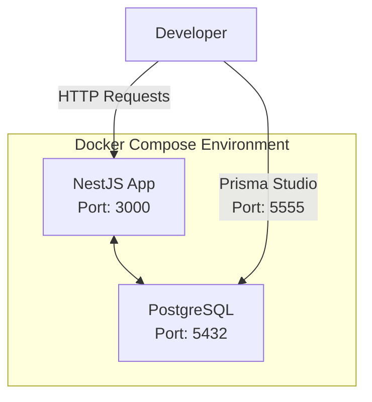
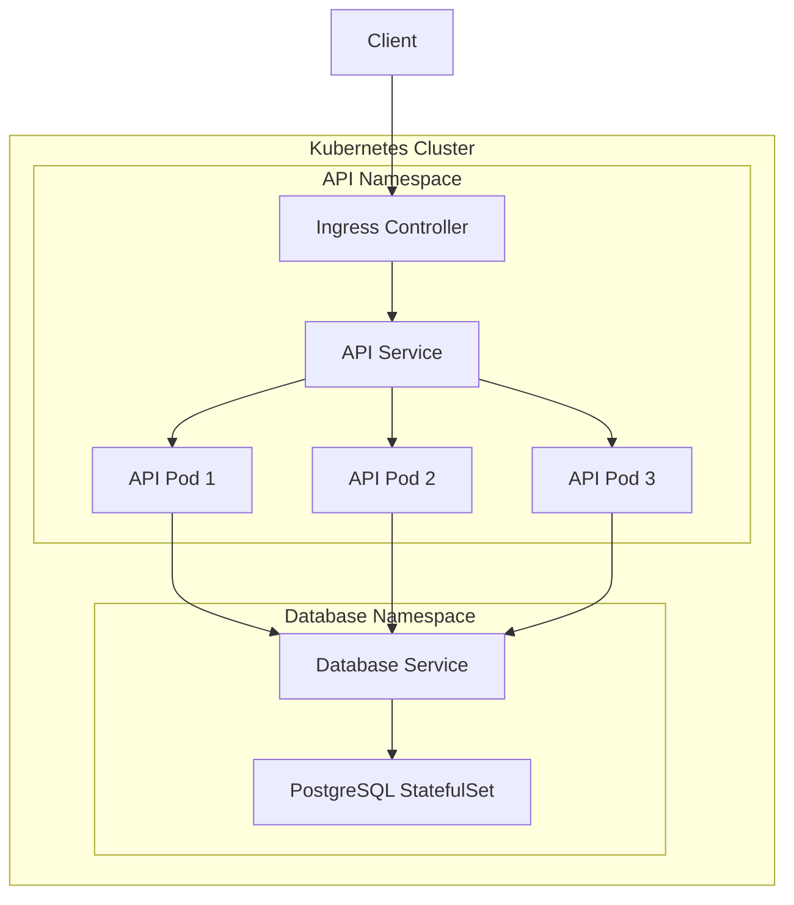
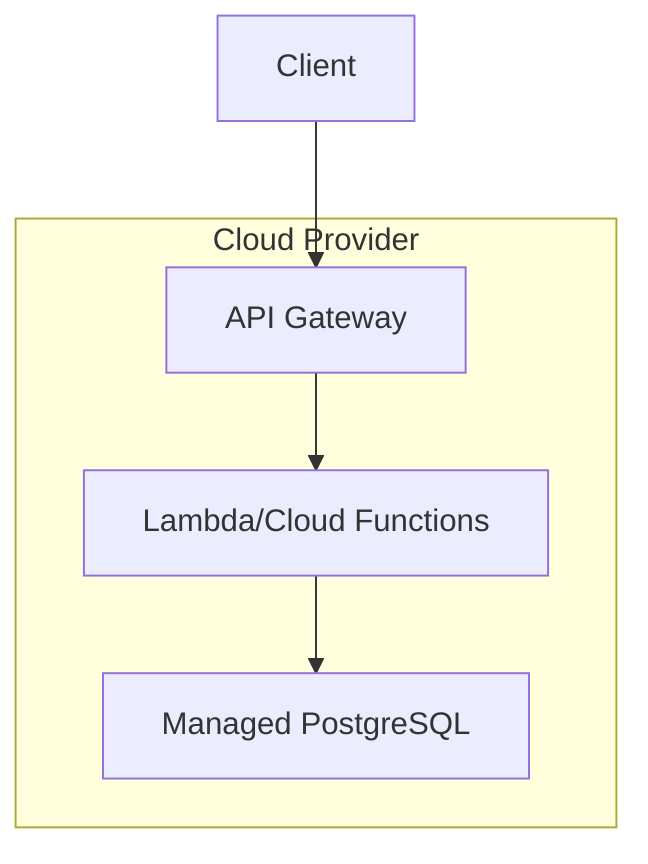

# Deployment View

## Infrastructure

The NestJS template is designed to be deployed in various environments, with Docker as the primary containerization method.

### Deployment Diagram

```mermaid
deploymentDiagram
    node "Production Environment" {
        node "Container Orchestration" {
            node "API Container" as APIContainer {
                artifact "NestJS Application" as NestApp
            }
            
            node "Database Container" as DBContainer {
                artifact "PostgreSQL" as PostgreSQL
            }
        }
        
        node "External Services" {
            artifact "Email Service" as EmailService
        }
    }
    
    node "Development Environment" {
        node "Docker Compose" {
            node "API Dev Container" as DevAPIContainer {
                artifact "NestJS Dev App" as DevNestApp
            }
            
            node "Database Dev Container" as DevDBContainer {
                artifact "PostgreSQL Dev" as DevPostgreSQL
            }
        }
    }
    
    node "CI/CD Pipeline" {
        artifact "GitHub Actions" as GithubActions
        artifact "Automated Tests" as Tests
    }
    
    APIContainer -- DBContainer : "TCP/IP"
    APIContainer -- EmailService : "SMTP"
    GithubActions -- Tests
    GithubActions -- APIContainer : "Deploys"
```

## Infrastructure Elements

| Element | Description | Technology |
|---------|-------------|------------|
| API Container | Hosts the NestJS application | Docker, Node.js |
| Database Container | Stores application data | Docker, PostgreSQL |
| Email Service | External service for email delivery | SMTP provider (e.g., SendGrid) |
| CI/CD Pipeline | Automated build, test, and deployment | GitHub Actions |

## Local Development Setup

For local development, Docker Compose is used to create a consistent environment:



### Docker Compose Configuration

The repository includes a `docker-compose.yml` file that sets up the necessary services:

- NestJS application container 
- PostgreSQL database container

This configuration ensures that all developers work with the same environment, reducing "it works on my machine" issues.

## Production Deployment Options

### Kubernetes Deployment

For production environments, a Kubernetes deployment is recommended:



### Serverless Deployment

For cases where serverless architecture is preferred:



## Configuration Management

The application uses environment variables for configuration:

- JWT secrets and expiration times
- Database connection details
- Email service credentials
- API rate limiting settings
- Two-factor authentication settings

In production environments, these should be managed through a secure configuration management system appropriate to the deployment platform (e.g., Kubernetes Secrets, AWS Parameter Store).

## Scaling Considerations

The stateless nature of the application allows horizontal scaling of the API containers. The database may require vertical scaling initially, with consideration for read replicas or sharding for very high loads.

The rate limiting implementation must be configured appropriately when running multiple instances, potentially using a distributed cache (Redis) for coordination.
