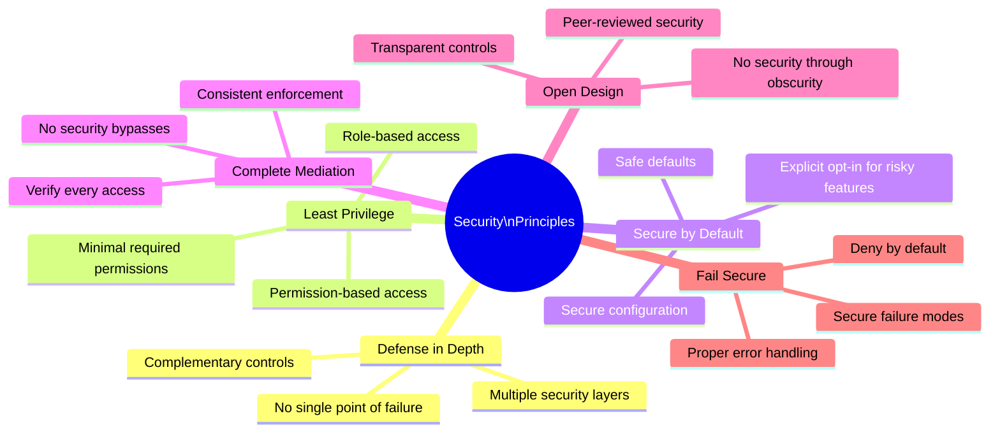
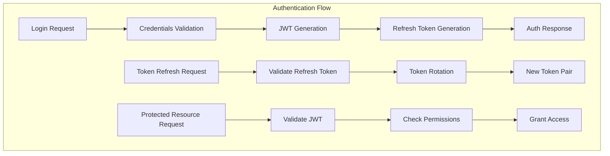
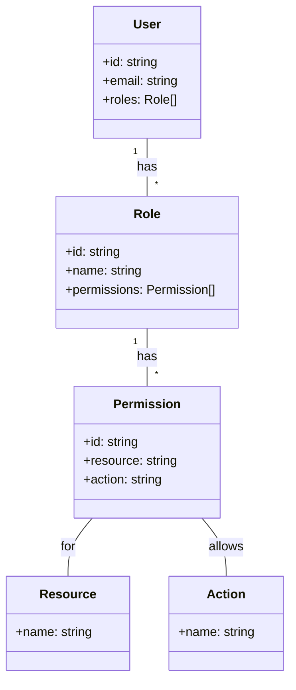
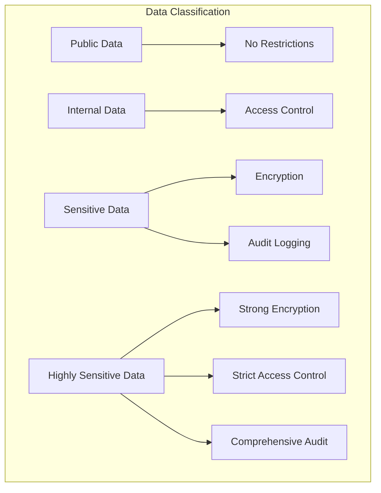
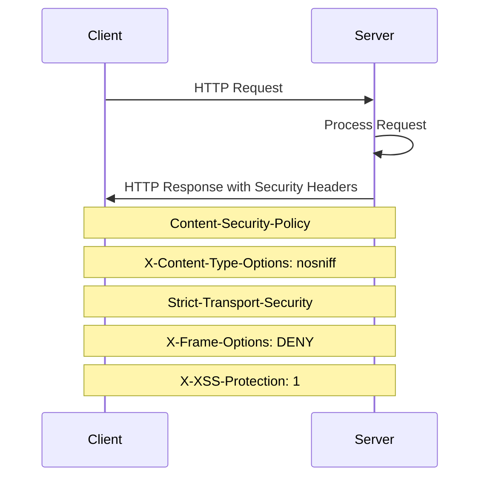
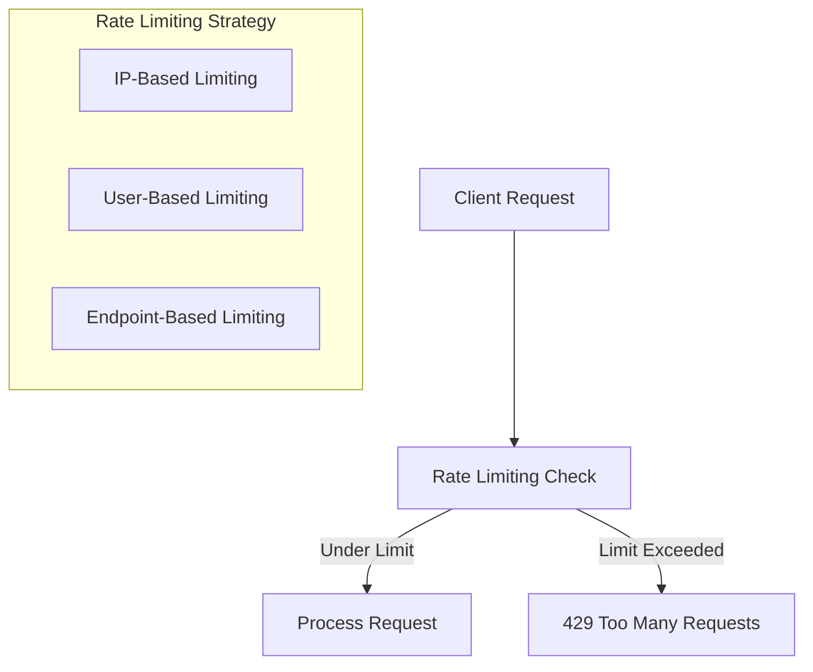
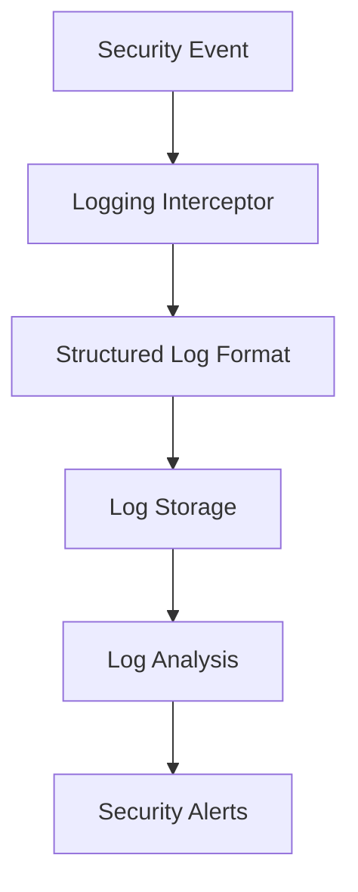

# Security Architecture

## Overview

This document outlines the security architecture of the application, covering authentication, authorization, data protection, and other security measures implemented to protect the system and its data.

## Security Principles

## Authentication Architecture

### Authentication Components

| Component | Description | Security Features |
|-----------|-------------|-------------------||
| JWT Authentication | JSON Web Token based authentication | Short-lived tokens, secure signature, proper claims |
| Refresh Token | Mechanism for obtaining new access tokens | Secure storage, one-time use, rotation on use |
| Password Handling | Secure password management | Bcrypt hashing, password policies, breach detection |
| Two-Factor Authentication | Additional verification layer | TOTP implementation, QR code, recovery codes |
| Email Verification | Verifying user email ownership | Secure tokens, expiration, rate limiting |

## Authorization Model

### Authorization Components

| Component | Description | Implementation |
|-----------|-------------|----------------|
| Role-Based Access Control | Access control based on roles | User-role assignments, role checks |
| Permission-Based Access Control | Fine-grained permission control | Resource-action permissions, permission checks |
| Guards | Request authorization | JWT guard, role guard, permission guard |
| Decorators | Declarative authorization | @Roles(), @Permissions(), @Public() |

## Data Protection

### Sensitive Data Handling

| Data Type | Protection Measures | Examples |
|-----------|---------------------|----------|
| Authentication Credentials | Hashing, encryption in transit | Passwords, tokens |
| Personal Data | Encryption, access control | Email, name |
| Session Data | Secure storage, proper expiration | Session tokens |

### Encryption Strategy

| Type | Usage | Implementation |
|------|-------|----------------|
| Transport Encryption | Data in transit | HTTPS/TLS |
| Storage Encryption | Data at rest | Database-level encryption |
| Field-level Encryption | Sensitive fields | Application-level encryption |

## Input Validation and Output Encoding

### Input Validation

- Comprehensive validation at controller level using DTOs and class-validator
- Domain-level validation in entities and value objects
- Structured validation error responses

### Output Encoding

- Content-Type headers with proper charset
- JSON encoding for API responses
- Prevention of data leakage through error messages

## Security Headers and Configuration

| Header | Purpose | Configuration |
|--------|---------|---------------|
| Content-Security-Policy | Prevent XSS attacks | Restrict resource loading |
| X-Content-Type-Options | Prevent MIME sniffing | nosniff |
| Strict-Transport-Security | Enforce HTTPS | max-age=31536000; includeSubDomains |
| X-Frame-Options | Prevent clickjacking | DENY |
| X-XSS-Protection | Additional XSS protection | 1; mode=block |

## Rate Limiting and DOS Protection

| Protection | Implementation | Configuration |
|------------|----------------|---------------|
| Global Rate Limiting | Default limits for all endpoints | Configurable thresholds |
| Endpoint-specific Limiting | Higher limits for public endpoints, lower for sensitive | @Throttle() decorator |
| Authentication Rate Limiting | Stricter limits for auth endpoints | Prevent brute force |

## Audit Logging and Monitoring

### Audit Events

| Event Category | Events Logged | Detail Level |
|----------------|---------------|-------------|
| Authentication | Login attempts, logouts, token refresh | IP, user, timestamp, success/failure |
| Authorization | Access attempts, permission checks | Resource, action, user, timestamp, result |
| User Management | User creation, role changes, permission changes | Admin user, affected user, changes made |
| Data Modification | Sensitive data updates | User, fields changed (not values), timestamp |

### Logging Implementation

## Secure Development Practices

### Security Testing

- SAST (Static Application Security Testing) in CI/CD pipeline
- Dependency vulnerability scanning
- Regular security reviews and penetration testing

### Security Updates

- Regular dependency updates
- Security patch management
- Vulnerability disclosure process

## Threat Modeling

### Key Threats and Mitigations

| Threat | Potential Impact | Mitigation |
|--------|------------------|------------|
| Authentication Bypass | Unauthorized access | Strong authentication, JWT validation, proper session management |
| Authorization Flaws | Access to unauthorized resources | Fine-grained permissions, consistent authorization checks |
| Injection Attacks | Data manipulation, information disclosure | Input validation, parameterized queries, ORM usage |
| Data Exposure | Privacy violations, compliance issues | Encryption, access controls, data minimization |
| Denial of Service | Service unavailability | Rate limiting, resource constraints, monitoring |

## Compliance Considerations

### Regulatory Compliance

| Regulation | Key Requirements | Implementation |
|------------|------------------|----------------|
| GDPR | Data protection, privacy, user rights | Consent management, data access controls, right to be forgotten |
| HIPAA | Health information protection | Additional encryption, stricter access controls, audit logging |
| PCI DSS | Payment card data security | Scope minimization, encryption, access controls |

This security architecture provides a comprehensive approach to protecting the application and its data through multiple layers of security controls and best practices.
