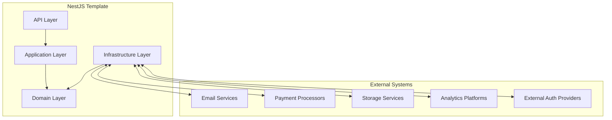
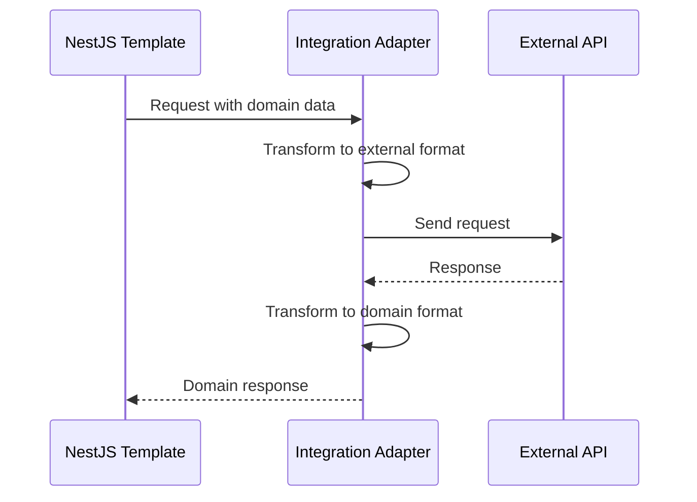
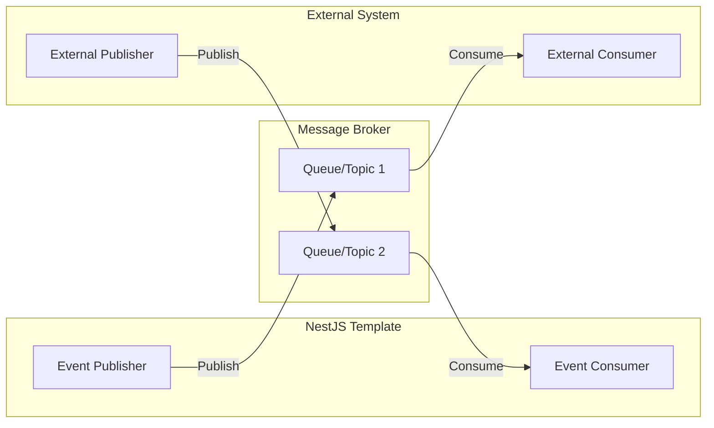
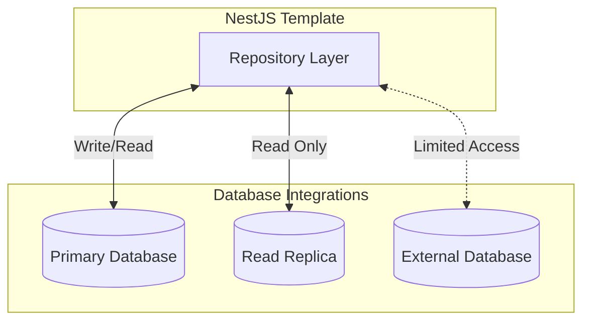
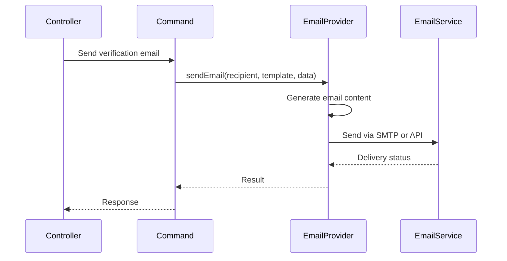
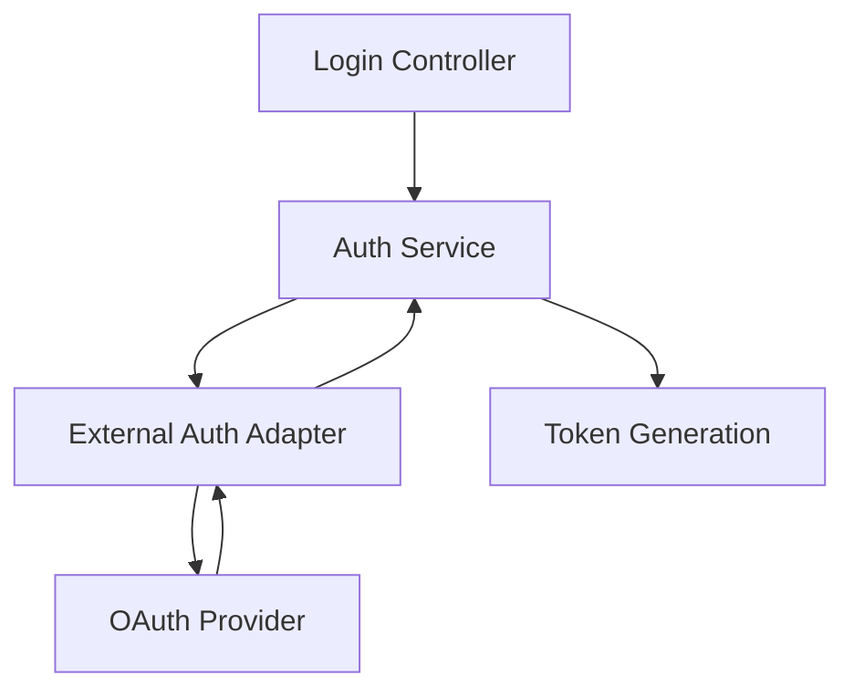
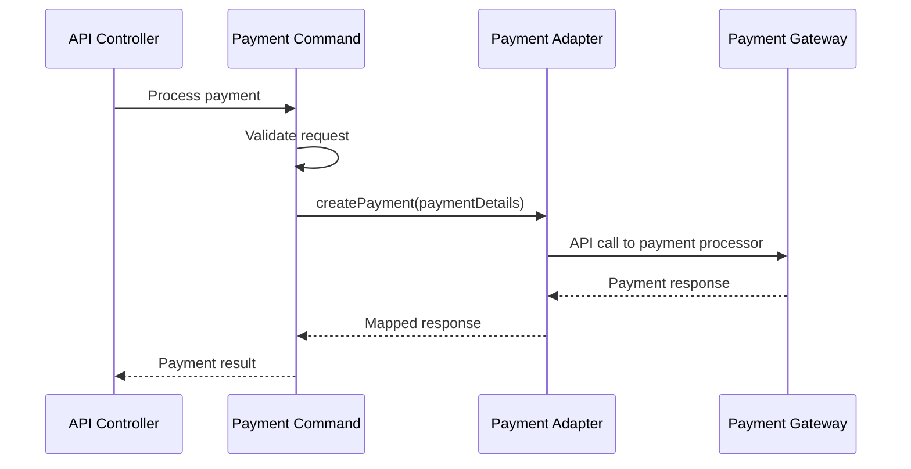
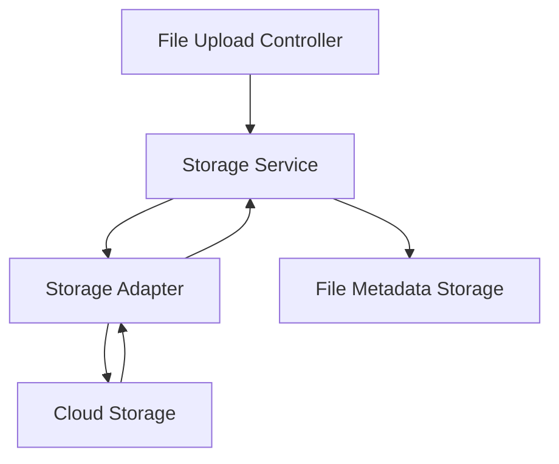
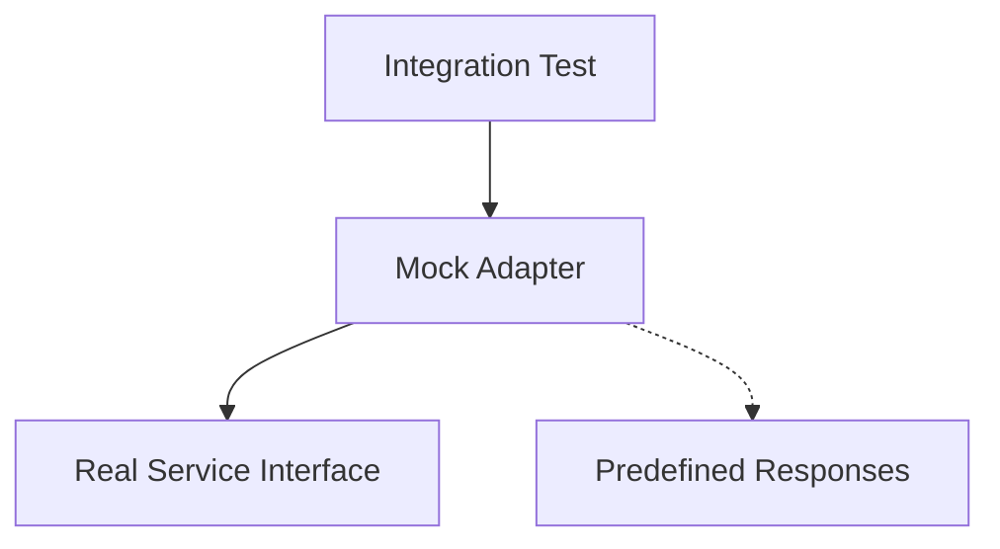

# System Integration Guide

## Introduction

This document provides guidance for integrating the NestJS Template with external systems and services. It outlines integration patterns, best practices, and specific considerations for common integration scenarios.

## Integration Architecture

The NestJS Template follows a clean architecture approach that facilitates integrating with external systems through well-defined boundaries.

## Integration Patterns

### 1. API-based Integration

**Best Practices:**
- Create dedicated adapters in the infrastructure layer
- Implement proper error handling and retries
- Use circuit breakers for fault tolerance
- Monitor and log integration points
- Consider rate limiting and throttling

### 2. Message-based Integration

**Best Practices:**
- Design a clear event schema
- Implement idempotent event handling
- Consider message persistence and delivery guarantees
- Implement proper error handling and dead-letter queues
- Monitor message processing

### 3. Database Integration

**Best Practices:**
- Use repository pattern for database abstraction
- Implement transactions for data consistency
- Consider data synchronization strategies
- Handle schema differences and migrations
- Monitor database performance

## Common Integration Scenarios

### Email Service Integration

The template already provides an email integration framework in the infrastructure layer.

**Implementation Guide:**
1. Configure email provider settings in environment variables
2. Implement a specific provider adapter in the infrastructure layer
3. Register the provider in the module configuration

### Authentication Provider Integration

For integrating external authentication providers (OAuth, SSO):

**Implementation Guide:**
1. Create an adapter for the specific authentication provider
2. Implement OAuth/OIDC flows in the authentication module
3. Map external user information to the internal user model
4. Generate internal authentication tokens after successful external auth

### Payment Processor Integration

**Implementation Guide:**
1. Create a payment service adapter in the infrastructure layer
2. Implement proper error handling and payment status tracking
3. Consider implementing webhooks for asynchronous payment updates
4. Secure payment information handling according to compliance requirements

### Storage Service Integration

**Implementation Guide:**
1. Create an adapter for the specific storage provider
2. Implement file operations (upload, download, delete)
3. Store file metadata in the database
4. Handle appropriate error scenarios and security considerations

## Security Considerations

### API Keys and Credentials

- **DO NOT** hardcode API keys or credentials in the code
- Use environment variables or a secure credential store
- Consider using a secret management service for production
- Implement credential rotation mechanisms

### Data Privacy

- Ensure personal data handling complies with relevant regulations (GDPR, CCPA, etc.)
- Implement data minimization principles
- Consider data encryption for sensitive information
- Document data flows for compliance purposes

### Security Validation

- Validate all inputs from external systems
- Implement proper authentication for incoming integration requests
- Consider rate limiting for integration endpoints
- Log and monitor integration activities for security analysis

## Testing Integration Points

### Mock Services

- Create mock implementations of external services for testing
- Use predefined test data that mimics real responses
- Test both success and error scenarios

### Integration Testing

- Implement specific integration tests for each external system
- Consider using test containers for database integrations
- Create sandbox environments for third-party API testing
- Include integration tests in the CI/CD pipeline

## Monitoring and Troubleshooting

### Monitoring Strategy

- Implement health checks for integration points
- Monitor response times and error rates
- Set up alerts for integration failures
- Log detailed information for troubleshooting

### Troubleshooting Guide

1. Check logs for specific error messages
2. Verify connectivity to external systems
3. Validate credentials and authentication
4. Review recent changes that might affect integration
5. Check external system status and maintenance notices

## Conclusion

Following these integration patterns and best practices will ensure that the NestJS Template can be successfully integrated with external systems while maintaining the clean architecture principles and system integrity.

When implementing new integrations:
1. Design the integration with clean architecture principles in mind
2. Implement in the infrastructure layer to maintain separation of concerns
3. Create comprehensive tests for the integration
4. Document the integration for future reference

For specific integration questions or issues, consult the development team or refer to the specific external system documentation.