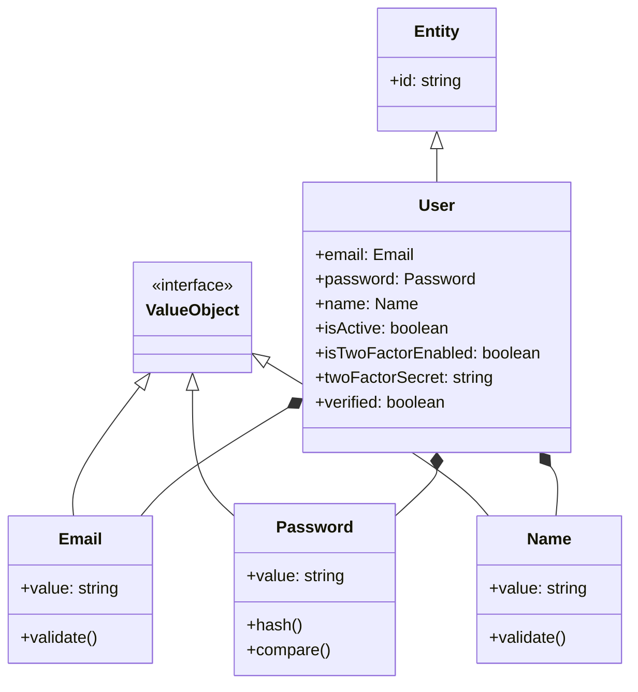
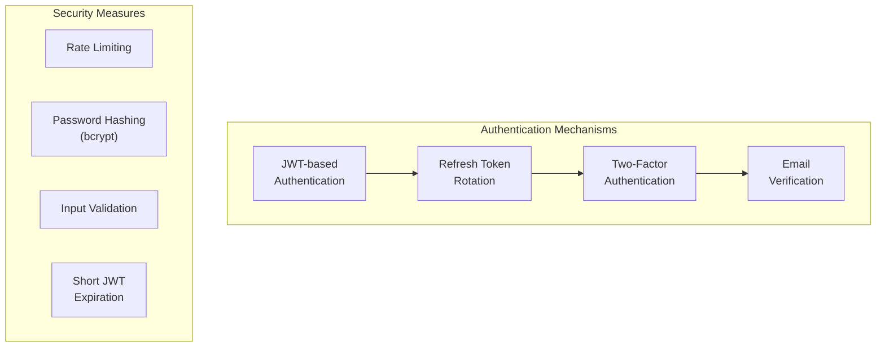
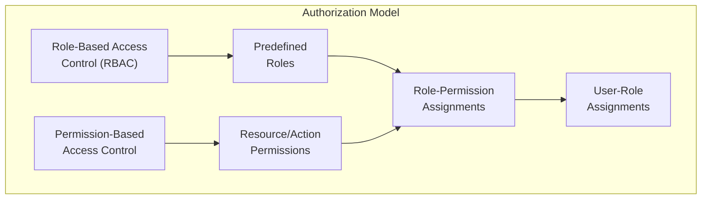
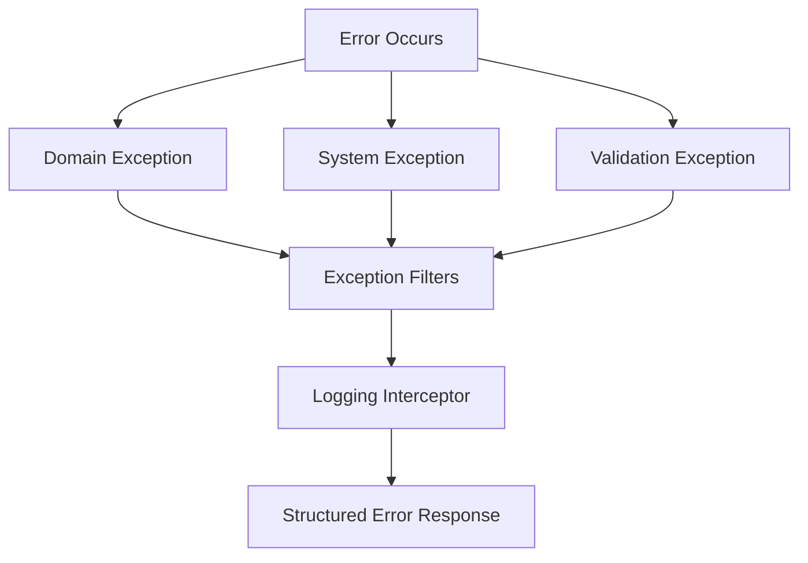
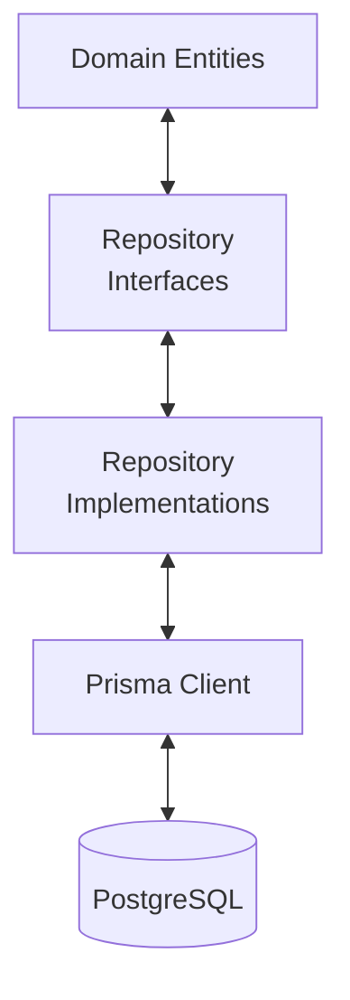
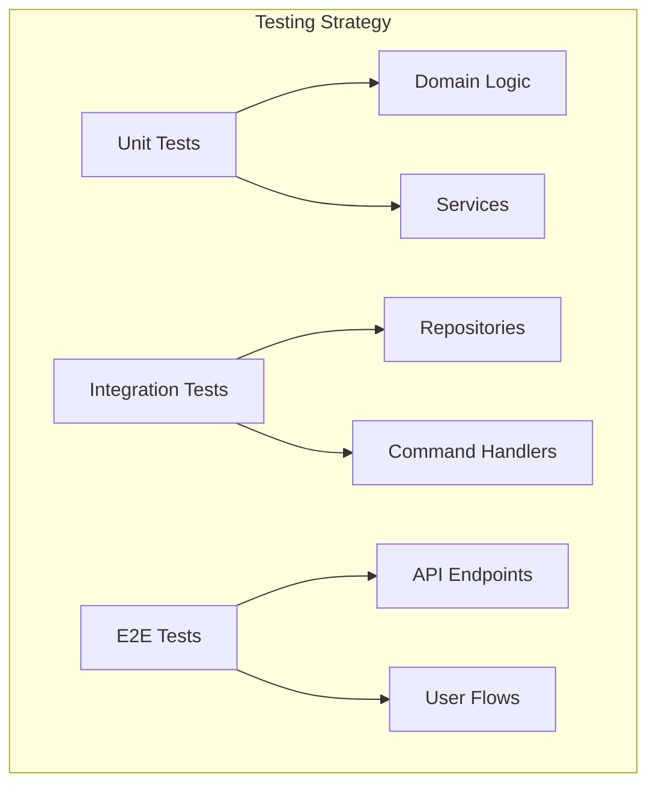
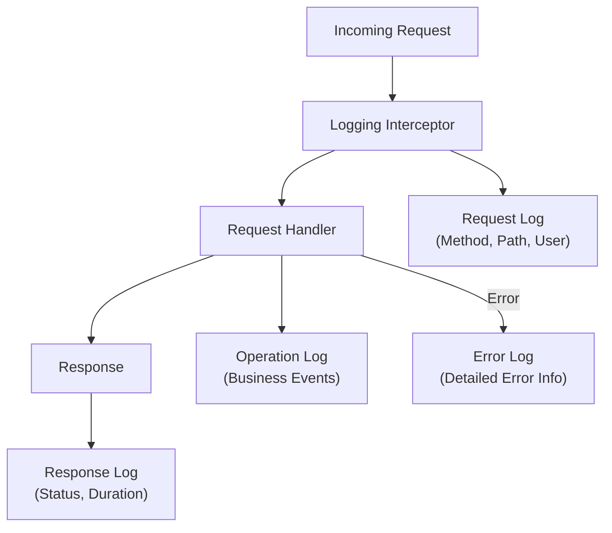

# Cross-cutting Concepts

## Domain Model

The domain model follows DDD principles, using entities, value objects, and domain services to encapsulate business logic.

## Security Concepts

### Authentication

The system uses a multi-layered authentication approach:

| Mechanism | Description |
|-----------|-------------|
| JWT Authentication | Stateless authentication with signed tokens |
| Refresh Token Rotation | Secure mechanism for obtaining new access tokens |
| Two-Factor Authentication | Optional additional security layer using TOTP |
| Email Verification | Ensures valid email ownership |
| Password Reset | Secure flow for resetting forgotten passwords |

### Authorization

The system implements a flexible permission model:

| Concept | Implementation |
|---------|----------------|
| RBAC | Users are assigned roles with associated permissions |
| PBAC | Fine-grained permissions based on resources and actions |
| Guards | NestJS guards for enforcing permissions at route level |
| Decorators | Custom decorators for defining required permissions |

## Error Handling

The application implements a comprehensive error handling strategy:

| Component | Purpose |
|-----------|--------|
| Domain Exceptions | Business rule violations |
| Exception Filters | Convert exceptions to appropriate HTTP responses |
| Logging Interceptor | Ensure all errors are properly logged |

## Persistence

The application uses Prisma ORM for database access:

| Layer | Responsibility |
|-------|----------------|
| Domain Entities | Business objects with behavior |
| Repository Interfaces | Define data access contracts |
| Repository Implementations | Implement data access with Prisma |
| Prisma Client | Type-safe ORM for database access |

## Testing

The application follows a comprehensive testing strategy:

| Test Type | Focus |
|-----------|-------|
| Unit Tests | Individual components in isolation |
| Integration Tests | Component interactions |
| E2E Tests | Complete API flows |

## Logging

The application uses a structured logging approach:

The logging system captures important information at various points in the request lifecycle, providing visibility into application behavior and performance.

These cross-cutting concepts ensure that the application maintains high standards of security, reliability, and maintainability throughout its implementation.
