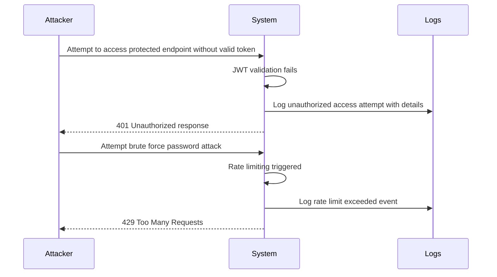
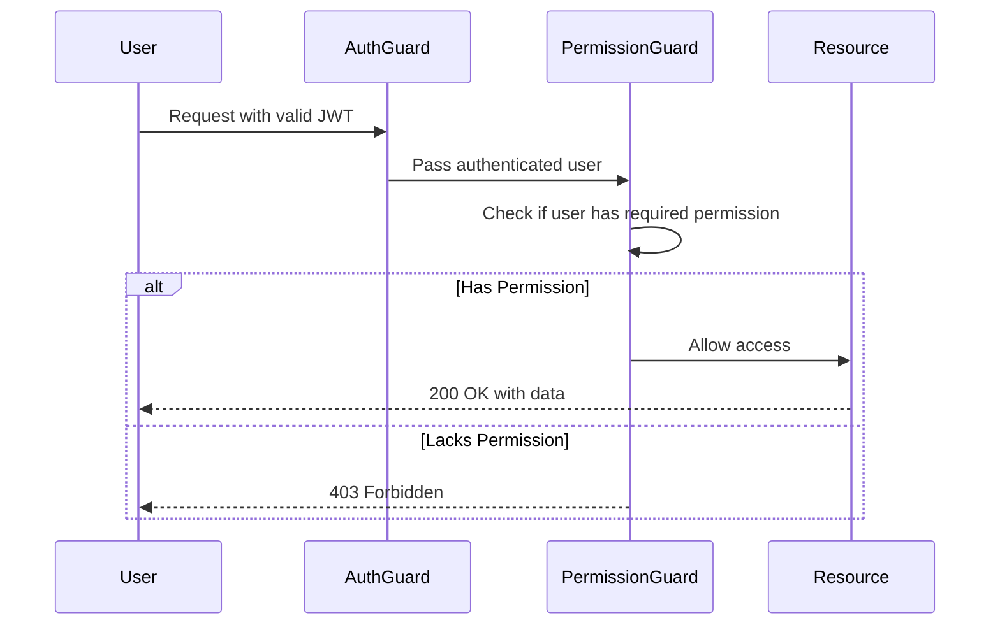
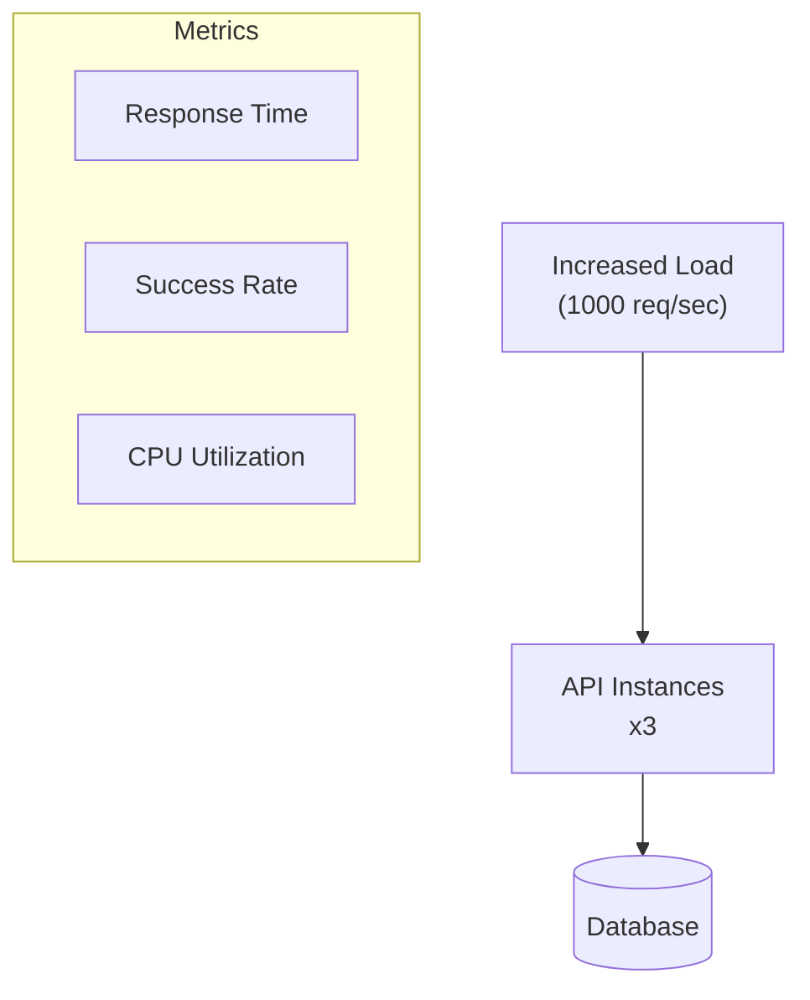
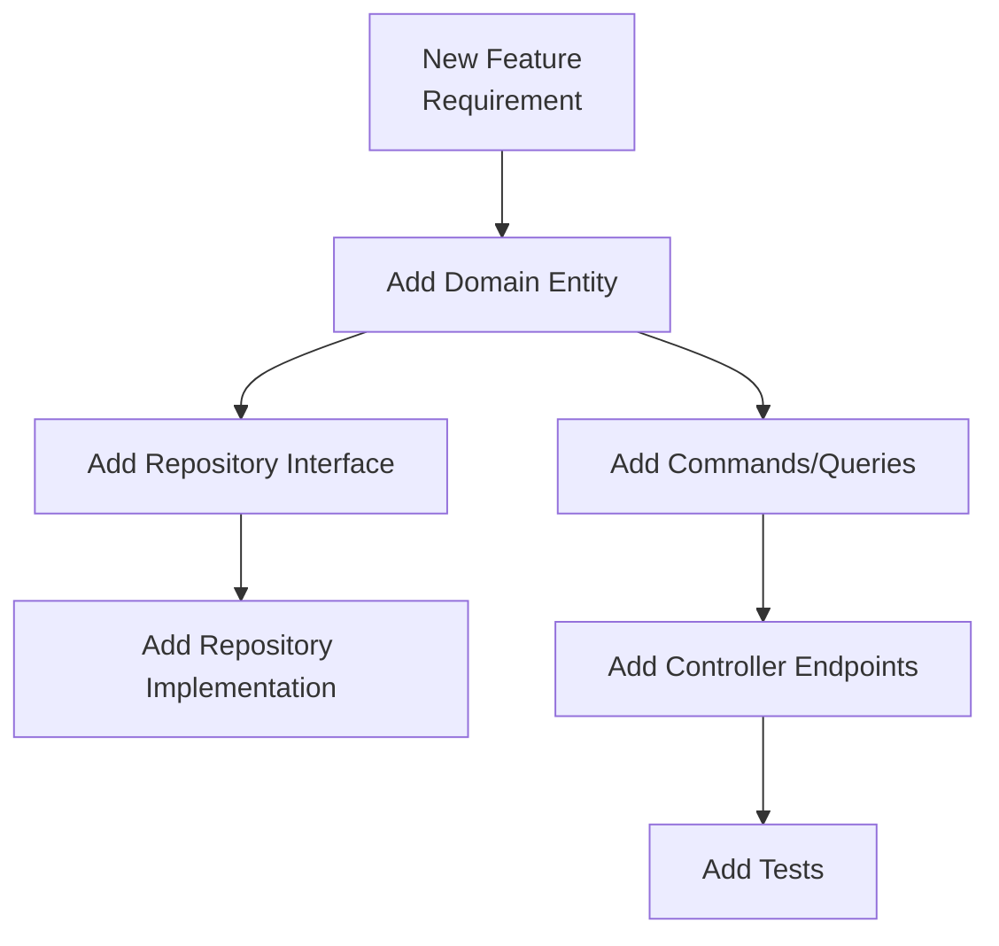
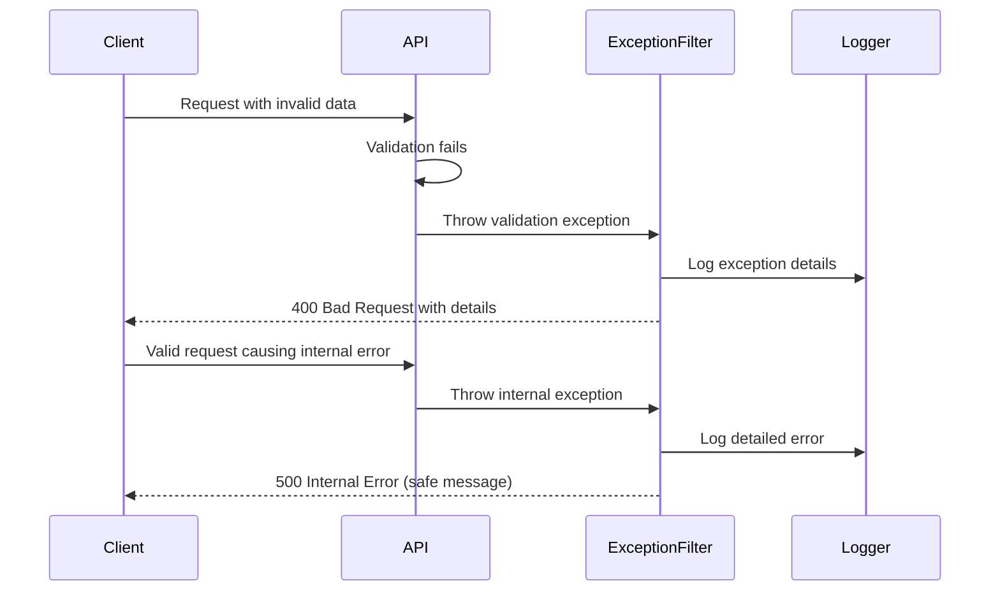
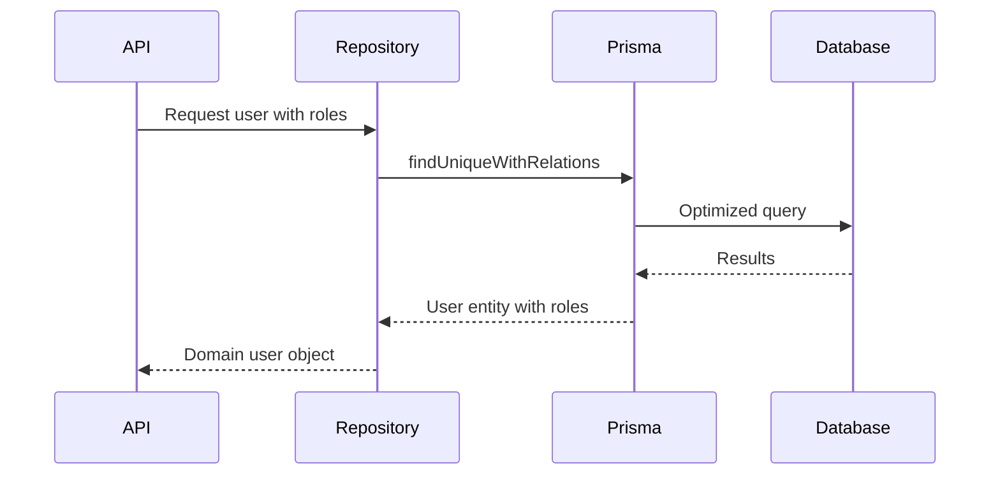

# Quality Requirements

## Quality Scenarios

This section outlines the key quality attributes for the NestJS template and specific scenarios that demonstrate these qualities.

### Security

#### Scenario 1: Authentication Breach Attempt

| Quality Attribute | Metric | Requirement |
|-------------------|--------|-------------|
| Authentication Security | Token validation | Invalid tokens must always be rejected |
| Brute Force Protection | Rate limiting | Lock account after 5 failed attempts in 10 minutes |
| Security Logging | Log completeness | All security events must be logged with client info |

#### Scenario 2: Data Access Control

| Quality Attribute | Metric | Requirement |
|-------------------|--------|-------------|
| Authorization Correctness | Permission enforcement | Users must only access resources they have permission for |
| Authorization Granularity | Permission specificity | Permissions must be granular to resource and action level |

### Scalability

#### Scenario 1: Increased Load Handling

| Quality Attribute | Metric | Requirement |
|-------------------|--------|-------------|
| API Throughput | Requests per second | Support 1000+ req/sec with horizontal scaling |
| Response Time | Latency under load | 95% of requests < 500ms at maximum load |
| Resource Utilization | CPU/Memory usage | Linear scaling of resources with load |

### Maintainability

#### Scenario 1: Adding New Business Feature

| Quality Attribute | Metric | Requirement |
|-------------------|--------|-------------|
| Modularity | Change isolation | Changes should affect < 5 components |
| Code Coverage | Test coverage | ≥ 80% test coverage for new code |
| Documentation | API documentation | All endpoints must be documented |

### Reliability

#### Scenario 1: Error Handling

| Quality Attribute | Metric | Requirement |
|-------------------|--------|-------------|
| Error Handling | Graceful degradation | No unhandled exceptions in production |
| Error Logging | Log detail | All errors logged with stack traces and context |
| Error Responses | Client information | Clear error messages for client fixable issues |

### Performance

#### Scenario 1: Database Query Optimization

| Quality Attribute | Metric | Requirement |
|-------------------|--------|-------------|
| Query Performance | Query execution time | Complex queries < 100ms |
| Data Loading | Selective loading | Only load required relations |
| Response Size | Payload size | Responses < 100KB for list endpoints |

## Quality Measures

### Security Measures

| Measure | Description |
|---------|-------------|
| JWT Authentication | Short-lived tokens with proper signing |
| Password Hashing | bcrypt with appropriate work factor |
| Input Validation | Comprehensive validation on all inputs |
| Rate Limiting | Configurable limits on sensitive endpoints |
| CORS Configuration | Strict origin policies |
| Security Headers | Appropriate HTTP security headers |

### Performance Measures

| Measure | Description |
|---------|-------------|
| Query Optimization | Efficient database queries with proper indexing |
| Selective Loading | Only load required data and relations |
| Response Transformation | Transform data close to the database |
| Caching Strategy | Cache appropriate responses |

### Maintainability Measures

| Measure | Description |
|---------|-------------|
| Clean Architecture | Clear separation of concerns |
| Coding Standards | Consistent style enforced by ESLint |
| Type Safety | Comprehensive TypeScript types |
| Documentation | Inline code documentation and API docs |
| Testing Strategy | Unit, integration, and E2E tests |

### Reliability Measures

| Measure | Description |
|---------|-------------|
| Exception Handling | Comprehensive exception filters |
| Logging Strategy | Structured logging at appropriate levels |
| Validation | Input validation at controller and domain levels |
| Circuit Breaking | Appropriate handling of external service failures |

These quality requirements and measures ensure that the NestJS template provides a solid foundation for building secure, scalable, and maintainable applications.
