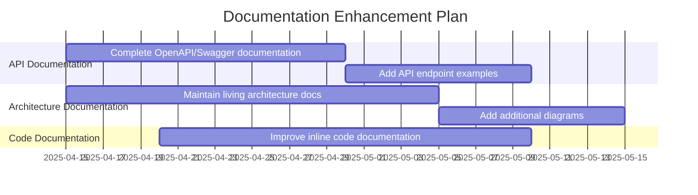
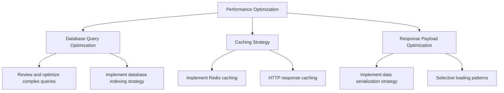
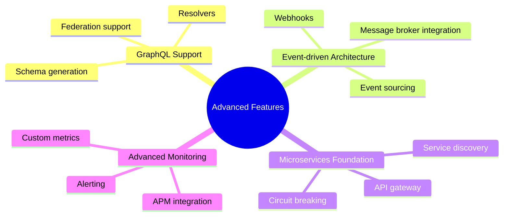

# Technical Roadmap

## Overview

This document outlines the technical roadmap for the NestJS Template, providing a strategic plan for future development and improvements. The roadmap is organized into short-term, medium-term, and long-term initiatives, with a focus on enhancing the template's capabilities, security, and developer experience.

## Short-term Initiatives (0-3 months)

### 1. Documentation Enhancements

**Key Deliverables:**
- Complete OpenAPI/Swagger documentation for all endpoints
- Enhanced code documentation for core components
- Improved developer onboarding guide

### 2. Security Enhancements

**Key Deliverables:**
- Regular security audit implementation
- Dependency vulnerability scanning automation
- Enhanced rate limiting for critical endpoints
- Implementation of security headers

### 3. Testing Improvements

**Key Deliverables:**
- Increase unit test coverage to ≥80%
- Enhance integration test suite
- Implement E2E test scenarios for critical user flows
- Set up code coverage reporting

## Medium-term Initiatives (3-6 months)

### 1. Performance Optimization

**Key Deliverables:**
- Database query optimization
- Implementation of Redis-based caching
- Response payload optimization
- Performance testing framework

### 2. Developer Experience Improvements

**Key Deliverables:**
- Enhanced CLI tooling for common operations
- Improved error messages and debugging experience
- Streamlined local development environment

### 3. Infrastructure as Code

**Key Deliverables:**
- Terraform configurations for major cloud providers
- Enhanced Docker and Docker Compose setups
- Kubernetes deployment configurations

## Long-term Initiatives (6+ months)

### 1. Advanced Features

**Key Deliverables:**
- GraphQL API implementation alongside REST
- Event-driven architecture capabilities
- Framework for microservices conversion
- Advanced monitoring and observability

### 2. Cloud-Native Features

**Key Deliverables:**
- Serverless deployment options
- Cloud provider integrations
- Distributed tracing support
- Auto-scaling configurations

## Continuous Improvement Areas

### Code Quality

- Regular code quality reviews
- Automated code quality checks
- Technical debt reduction sprints (20% of development time)
- Refactoring of identified problem areas

### Security

- Quarterly security reviews
- Dependency vulnerability monitoring
- Security testing automation
- Security patches and updates

### DevOps

- CI/CD pipeline enhancements
- Automated testing improvements
- Deployment automation refinements
- Environment management

## Success Metrics

| Area | Metric | Target |
|------|--------|--------|
| Documentation | Documentation completeness | 100% API coverage, >80% code documentation |
| Code Quality | Test coverage | ≥80% code coverage |
| Code Quality | Static analysis issues | <5 issues per 1000 lines |
| Performance | API response time | 95% of requests under 100ms |
| Security | Dependency vulnerabilities | Zero high or critical vulnerabilities |
| Developer Experience | Setup time | <15 minutes for new developer onboarding |

## Revision History

| Version | Date | Author | Description |
|---------|------|--------|-------------|
| 1.0 | 2025-04-08 | Technical Architect | Initial roadmap document |

---

This roadmap is a living document and will be regularly reviewed and updated to reflect changing priorities, technologies, and requirements.
